# Screenshot Evidence Register — VProfile DevSecOps Platform on EKS

**Repository:** `github.com/yousefsalemW/DEVSECOPS-PLATFORM-EKS`
**Account / Region:** 450444046673 · eu-west-3
**Evidence captured:** 12 – 23 August 2026
**Total screenshots received:** 31 · **Selected:** 28 · **Rejected/redundant:** 3 · **Requiring redaction:** 0 · **Do-not-publish:** 0

---

## How to read this register

Every screenshot is treated as **evidence**, not illustration. Each entry answers the same four
questions, and the fourth is the one that matters most:

1. What is visible?
2. What does it prove?
3. **What does it NOT prove?**
4. Which repository file produced the thing being shown?

The third question is where most portfolio documentation fails. A screenshot of a green pipeline
proves the pipeline ran; it does not prove the application works. A screenshot of a completed
backup proves objects were written to S3; it does not prove they can be restored. Those
distinctions are made explicitly throughout, and where the evidence is weaker than the headline
suggests — most importantly the restore test in §9 — the register says so.

### Evidence-strength vocabulary

Used consistently in every entry:

| Term | Meaning |
|---|---|
| **Configuration** | A setting exists. Says nothing about whether it works. |
| **Deployment** | Something was installed or applied successfully. |
| **Execution** | A process ran to completion. |
| **Runtime state** | A system is currently in a given condition. |
| **Verification** | An independent check confirmed a claim. |
| **Validation** | End-to-end proof the control achieves its purpose. |

Ordered weakest to strongest. Only two screenshots in this project reach **Validation**
(SS-044 and SS-020); most reach Runtime state or Verification, which is normal and honest.

### Priority scale

| | Meaning |
|---|---|
| **P0** | Critical. Must appear in README and presentation. |
| **P1** | Strong technical evidence. Guide and interview material. |
| **P2** | Useful supporting detail. |
| **P3** | Low value. Context only. |
| **P4** | Redundant — superseded by a better screenshot. |
| **P5** | Do not publish. |

---

# Master Index

| ID | Screenshot | Category | Component | Phase | What it proves | Strength | Priority | Used in |
|---|---|---|---|---|---|---|---|---|
| SS-001 | Application — registered user session | Project | VProfile + ALB | Deployment | End-to-end request path works and writes to MySQL | Validation | **P0** | README · PPT · LinkedIn |
| SS-002 | Application — second user session | Project | VProfile | Deployment | Repeatable registration | Runtime | P2 | Evidence only |
| SS-003 | Application — seeded admin account | Project | VProfile + DB | Deployment | DB schema seeded and readable | Runtime | P1 | Guide |
| SS-010 | VPC resource map | AWS | VPC | Infrastructure | 3-AZ VPC with 6 subnets, 5 route tables | Deployment | P1 | Guide · PPT |
| SS-011 | Subnets across three AZs | AWS | Subnets | Infrastructure | Public/private split per AZ, /24 CIDRs | Deployment | P1 | Guide |
| SS-012 | NAT gateways ×3 | AWS | NAT | Infrastructure | One NAT per AZ, all Available | Deployment | P1 | Guide · Interview |
| SS-013 | Route tables | AWS | Routing | Infrastructure | Per-AZ private tables, one shared public | Configuration | P2 | Guide |
| SS-014 | EKS cluster Active + OIDC | AWS | EKS | Infrastructure | K8s 1.34 cluster healthy, OIDC provider present | Runtime | **P0** | README · PPT |
| SS-015 | S3 Velero bucket contents | AWS | S3 | Backup | Backup objects physically written to S3 | Verification | P1 | Guide |
| SS-016 | S3 bucket inventory | AWS | S3 | Infrastructure | Velero bucket exists in correct region | Configuration | P2 | Evidence only |
| SS-020 | Pipeline — 11 stages incl. Deploy | Jenkins | CI/CD | CI/CD | Full build→scan→push→deploy chain succeeded | Validation | **P0** | README · PPT · Interview |
| SS-021 | Build history — 10 green builds | Jenkins | CI/CD | CI/CD | Pipeline is repeatable, not a one-off | Execution | P1 | Guide · Interview |
| SS-022 | Early pipeline — builds #1/#2 failed | Jenkins | CI/CD | Troubleshooting | Gates genuinely block; iteration was real | Execution | P1 | Troubleshooting · Interview |
| SS-023 | Console — image push + cleanup | Jenkins | CI/CD | CI/CD | Images tagged by commit SHA, creds logged out | Execution | P2 | Guide |
| SS-024 | Jenkins initial setup | Jenkins | Jenkins | Setup | Jenkins 2.568.2 installed | Configuration | **P4** | Do not use |
| SS-030 | Jenkins box — SonarQube + Jenkins | Compute | EC2 | Infrastructure | Both CI services healthy on one host | Runtime | P1 | Guide |
| SS-031 | Nodes Ready + system pods | K8s | Nodes | Deployment | 3 nodes Ready, CNI/CSI/DNS all Running | Runtime | **P0** | README · Guide |
| SS-032 | Jenkins service account cluster access | K8s | RBAC | Security | The `jenkins` OS user can reach the API | Verification | P1 | Troubleshooting · Interview |
| SS-033 | Restored PVC labels + teardown | K8s | PVC | DR | PVC carries Velero restore label; clean teardown | Verification | P1 | Guide · Interview |
| SS-040 | Vault dashboard — Raft + KV | Vault | Vault | Security | Raft storage, KV v2 mounted, unsealed | Runtime | P1 | Guide |
| SS-041 | KV path `vprofile/app01` | Vault | Secrets | Security | Both credentials stored, values masked in UI | Deployment | **P0** | README · PPT |
| SS-042 | ACL policy list | Vault | Policies | Security | Exactly one custom policy exists | Configuration | P2 | Guide |
| SS-043 | Policy HCL — read on one path | Vault | Policies | Security | Least privilege is literal, not claimed | Configuration | **P0** | Guide · Interview · LinkedIn |
| SS-044 | K8s auth role → `vprofile:app01` | Vault | Auth | Security | Identity binding is namespace+SA scoped | Validation | **P0** | README · PPT · Interview |
| SS-050 | Grafana — cluster compute | Monitoring | Grafana | Observability | All 5 namespaces scraped with live metrics | Runtime | **P0** | README · PPT · LinkedIn |
| SS-051 | Grafana — vprofile namespace pods | Monitoring | Grafana | Observability | Per-pod CPU/memory against requests/limits | Runtime | **P0** | Guide · PPT |
| SS-052 | Grafana — nodes overview | Monitoring | Grafana | Observability | Node capacity vs. requests over 6h | Runtime | P1 | Guide |
| SS-053 | Grafana dashboard inventory | Monitoring | Grafana | Observability | 24 dashboards provisioned automatically | Deployment | P2 | Guide |
| SS-060 | Velero backup Completed | Velero | Backup | DR | Backup ran to completion, zero errors | Execution | **P0** | README · PPT |
| SS-061 | Backup contents + EBS snapshot | Velero | Backup | DR | 25 objects + snapshot succeeded + hook attempted | Verification | **P0** | Guide · Interview |
| SS-062 | Restore **PartiallyFailed** | Velero | Restore | DR | Restore executed with 1 error, 4 warnings | Execution | **P0** | Troubleshooting · Interview |

---

# Category 01 — Project Outcome

## SS-001 — Application reachable through ALB with a registered user

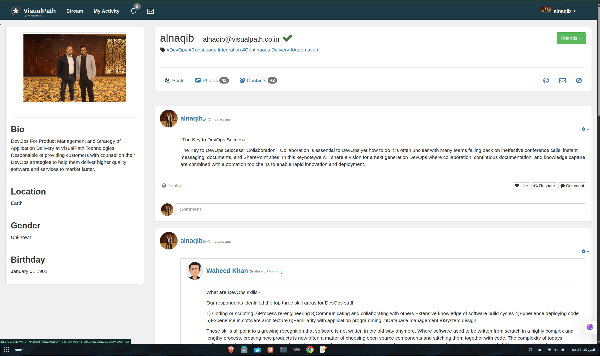

### Classification
| | |
|---|---|
| Category / Subcategory | Project Overview / Application runtime |
| Phase | Deployment |
| Component | VProfile web tier → app tier → MySQL |
| AWS service | Application Load Balancer |
| K8s resources | Ingress `vprofile`, Deployment `vproweb`, Deployment `app01`, StatefulSet `db01` |
| Evidence strength | **Validation** |
| Priority | **P0** |

### What is shown
The VProfile application rendered in a browser, logged in as user **`alnaqib`** — an account
created during testing, not one of the seeded demo accounts. The browser status bar exposes the
target hostname `k8s-vprofile-vprofile-2fbef1d522-…eu-west-3.elb.amazonaws.com`, confirming
traffic arrived through the AWS-provisioned ALB. Profile fields, posts and a comment box are
populated.

### What it proves
The **entire request path is functional end to end**: client → ALB → `vproweb` (nginx) →
`app01` (Tomcat/Spring) → `db01` (MySQL). A logged-in session with a non-seeded username proves
more than a login page would — the account had to be **written to the database and read back**,
which exercises the JDBC connection, the credentials injected from the Kubernetes Secret, and
session handling across replicas. Rendered post content additionally implies the Memcached and
RabbitMQ dependencies did not block page assembly.

This is the single screenshot that makes every other screenshot meaningful. Infrastructure that
does not serve the application is not evidence of anything.

### What it does NOT prove
- **Not** that HTTPS is configured — this is plain HTTP; no ACM certificate or Route 53 record exists.
- **Not** that the application reads its credentials from Vault. At this point it still reads them from Kubernetes Secrets (see §7 for the gap statement).
- **Not** load capacity, latency, or behaviour under concurrency — no load test was performed.
- **Not** that sticky sessions are correctly configured for every flow, only that this session survived.

### Why it matters
The 403-on-registration incident earlier in this project had three stacked causes (in-memory
sessions across two replicas without affinity, a Hibernate `GenerationType.AUTO` incompatibility,
and a misleading diagnostic that hit the Service rather than a single pod). A successfully
registered and logged-in user is the direct verification that all three fixes hold.

### Related repository files
```text
helm/vprofile/templates/40-app01.yaml
helm/vprofile/templates/50-vproweb.yaml
helm/vprofile/templates/60-ingress.yaml
helm/vprofile/values.yaml
```

### Interview questions this supports
1. How did you verify the deployment actually worked, rather than just that pods were Running?
2. Walk me through the request path from browser to database in your architecture.
3. You mentioned a 403 on registration — what were the causes and how did you confirm the fix?
4. Why does a logged-in session prove more than a reachable login page?

### Security review
**Safe to publish.** The ALB hostname is no longer live (infrastructure destroyed). No credentials
are visible. The displayed content is demo seed data shipped with VProfile.

> **Evidence summary:** This screenshot provides evidence that the full five-tier application stack served an authenticated, database-backed user session through the AWS-provisioned ALB.

---

## SS-002 — Application, second user session

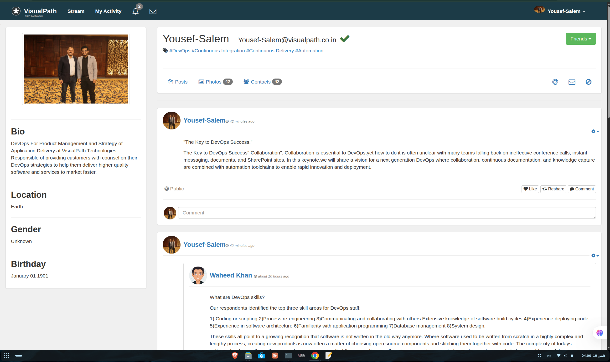

| | |
|---|---|
| Category | Project Overview |
| Evidence strength | Runtime state |
| Priority | P2 — *near-duplicate of SS-001* |

**Shown:** the same application, logged in as `Yousef-Salem`.

**Proves:** registration is repeatable rather than a single lucky write.

**Does NOT prove:** anything SS-001 does not already prove more strongly — SS-001 additionally
exposes the ALB hostname in the status bar.

**Usage:** evidence archive only. Do not place in README or presentation; it competes with SS-001
without adding information.

> **Evidence summary:** This screenshot provides evidence that user registration succeeded more than once, supporting SS-001.

---

## SS-003 — Seeded administrator account

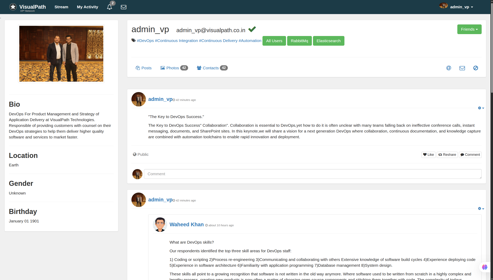

| | |
|---|---|
| Category | Project Overview |
| Component | MySQL `accounts` schema |
| Evidence strength | Runtime state |
| Priority | P1 |

**Shown:** a session as `admin_vp`, the account shipped in VProfile's seed SQL. The header displays
`All Users`, `RabbitMq` and `Elasticsearch` navigation.

**Proves:** the database was initialised with the application schema and seed data, and the
application can read it. This is distinct from SS-001, which proves *writes*; this proves the
**initial data load ran**.

**Does NOT prove:** that RabbitMQ or Elasticsearch are functional. Those are navigation links
present in the UI regardless of backend state. Elasticsearch was in fact **removed** from this
deployment during image hardening — the link is a UI remnant. Do not caption this screenshot as
evidence of a working search tier.

**Related files:** `Build-Images/images/db/` (schema seed), `helm/vprofile/templates/10-db01.yaml`

> **Evidence summary:** This screenshot provides evidence that the MySQL schema was seeded and is readable by the application tier.

---

# Category 02 — AWS Infrastructure

## SS-010 — VPC resource map

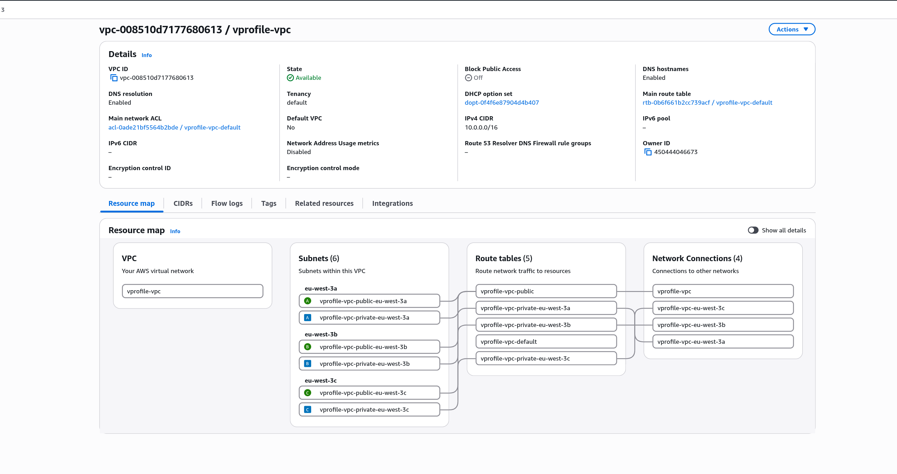

### Classification
| | |
|---|---|
| Category / Subcategory | AWS Infrastructure / VPC |
| Phase | Infrastructure provisioning |
| AWS service | Amazon VPC |
| Evidence strength | Deployment |
| Priority | P1 |

### What is shown
The console resource map for `vpc-008510d7177680613 / vprofile-vpc`. State **Available**, IPv4 CIDR
`10.0.0.0/16`, DNS hostnames and DNS resolution both **Enabled**. The map enumerates **6 subnets**
across `eu-west-3a/b/c` — one public and one private per AZ — **5 route tables**, and **4 network
connections**.

### What it proves
Terraform provisioned a **genuinely multi-AZ network**, not a single-AZ layout relabelled. The
public/private pairing per AZ is the precondition for everything downstream: private worker nodes,
a public-facing ALB, and per-AZ NAT egress.

DNS hostnames being enabled is not cosmetic — EKS requires it for node registration and in-cluster
service discovery.

### What it does NOT prove
- **Not** that the subnets carry the correct EKS discovery tags (`kubernetes.io/role/elb`, `kubernetes.io/role/internal-elb`). The map does not display tags; ALB creation succeeding (SS-001) is the indirect evidence.
- **Not** that security group rules are correct.
- **Not** that traffic actually flows — SS-031 and SS-001 carry that.

### Related repository files
```text
terraform/vpc.tf
```

### Interview questions this supports
1. Why three availability zones rather than two?
2. What breaks if DNS hostnames are disabled on a VPC hosting EKS?
3. How do subnets get selected for an ALB in EKS?

**Security review:** Safe to publish. VPC and subnet IDs are meaningless outside the account, and the account is destroyed.

> **Evidence summary:** This screenshot provides evidence that a three-AZ VPC with paired public/private subnets was provisioned by Terraform.

---

## SS-011 — Subnets across three availability zones

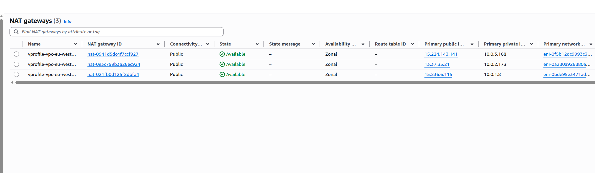

| | |
|---|---|
| Category | AWS / Networking |
| Evidence strength | Deployment |
| Priority | P1 |

**Shown:** the subnet list, filtered by neither VPC nor tag. Nine subnets total: **six** belonging
to `vprofile-vpc` (`10.0.1.0/24`, `10.0.2.0/24`, `10.0.3.0/24` public; `10.0.11.0/24`,
`10.0.12.0/24`, `10.0.13.0/24` private) and **three unnamed `172.31.x` subnets belonging to the
default VPC** (`vpc-002f49e76594a8c47`).

**Proves:** deliberate, readable CIDR allocation — the third octet encodes tier (1–3 public,
11–13 private) and the AZ letter maps to the last digit. This is a design decision, not an
accident of a module default.

**Does NOT prove:** that only six subnets exist in the account. **Read this screenshot carefully
before presenting it** — three of the nine rows are default-VPC subnets unrelated to this project.
Presenting "9 subnets" as project infrastructure would be inaccurate.

**Recommended handling:** crop to the six `vprofile-vpc` rows, or filter by VPC before recapturing.

**Related files:** `terraform/vpc.tf`

> **Evidence summary:** This screenshot provides evidence that six purpose-allocated subnets were created across three AZs, alongside unrelated default-VPC subnets.

---

## SS-012 — NAT gateways, one per availability zone

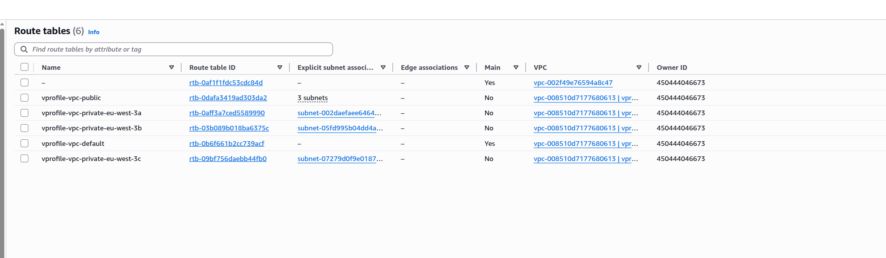

| | |
|---|---|
| Category | AWS / Networking |
| Evidence strength | Deployment |
| Priority | P1 |

**Shown:** three NAT gateways, all **Available**, all `Public` connectivity, each **Zonal** with a
distinct Elastic IP (`15.224.143.141`, `13.37.35.21`, `15.236.6.115`) and a private address in a
different AZ subnet (`10.0.3.168`, `10.0.2.173`, `10.0.1.8`).

**Proves:** egress is **genuinely zone-redundant**. Each private subnet routes through a NAT in its
own AZ, so losing one AZ does not remove internet egress for the other two.

**Does NOT prove:** that this was the cost-optimal choice. It was not — three NAT gateways cost
roughly **$3.46/day** versus $1.15 for one, and this was the largest single line item in the
project's burn rate. It was a **deliberate trade-off**: cross-AZ NAT traffic incurs data transfer
charges and creates a single-AZ dependency for all egress.

**This is a strong interview screenshot precisely because the trade-off is defensible in both
directions.** Being able to say "I chose availability over $2.30/day, and here is when I would
choose differently" demonstrates engineering judgement more than either choice alone.

**Related files:** `terraform/vpc.tf`

### Interview questions this supports
1. Why three NAT gateways instead of one? What does that cost?
2. When would you consolidate to a single NAT gateway?
3. What happens to a workload in `eu-west-3b` if the NAT in `3a` fails, in each design?

> **Evidence summary:** This screenshot provides evidence of zone-redundant NAT egress, a deliberate availability-over-cost trade-off.

---

## SS-013 — Route tables

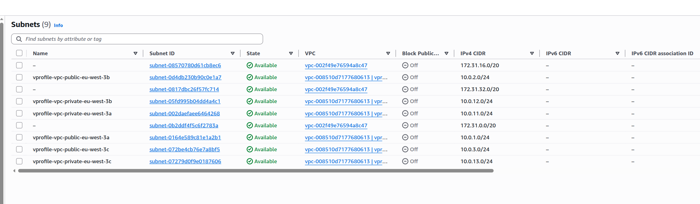

| | |
|---|---|
| Category | AWS / Networking |
| Evidence strength | Configuration |
| Priority | P2 |

**Shown:** six route tables. One `vprofile-vpc-public` with **3 subnet associations**, three
per-AZ private tables each with **1 association**, `vprofile-vpc-default`, and one belonging to the
default VPC.

**Proves:** the routing topology matches the NAT design — public subnets share one table
(one IGW route serves all three), while each private subnet has its **own** table so it can point
at the NAT in its own AZ. A shared private table would have silently defeated the three-NAT design.

**Does NOT prove:** the actual route entries. The console list shows associations, not destinations
or targets. To prove egress works you need SS-031 (nodes reached the API server and pulled images).

**Related files:** `terraform/vpc.tf`

> **Evidence summary:** This screenshot provides evidence that private subnets have independent route tables, which is what makes per-AZ NAT effective.

---

## SS-014 — EKS cluster Active with OIDC provider

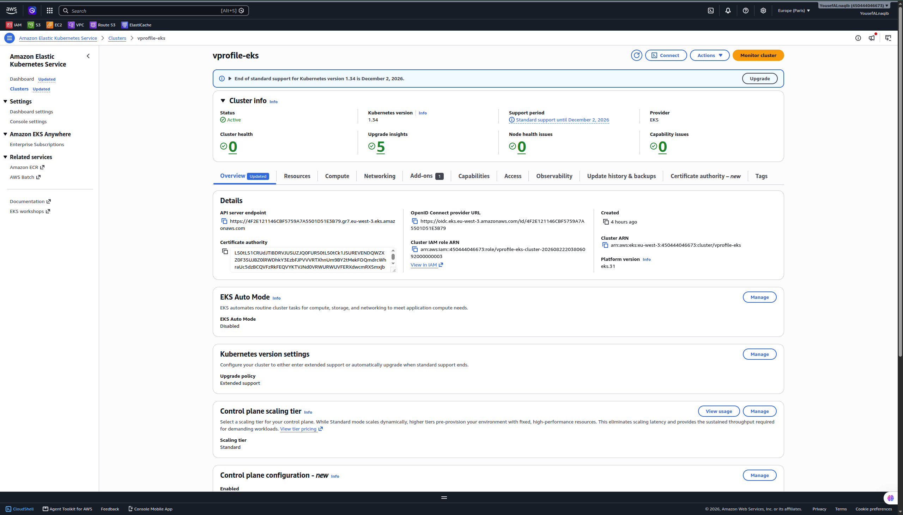

### Classification
| | |
|---|---|
| Category / Subcategory | AWS Infrastructure / EKS |
| Phase | Infrastructure provisioning |
| AWS service | Amazon EKS |
| Evidence strength | Runtime state |
| Priority | **P0** |

### What is shown
The `vprofile-eks` cluster overview. **Status Active**, **Kubernetes 1.34**, platform version
`eks.31`, created 4 hours prior. Health indicators: **Cluster health 0**, **Node health issues 0**,
**Capability issues 0**, Upgrade insights 5. The Details panel exposes the API server endpoint, the
**OpenID Connect provider URL** (`oidc.eks.eu-west-3.amazonaws.com/id/4F2E121146CBF5759A7A5501D51E3B79`),
the certificate authority, and the cluster IAM role ARN. EKS Auto Mode is **Disabled**.

### What it proves
Two things, and the second is the important one:

1. A current-version EKS control plane is running with zero health findings.
2. **An OIDC provider URL exists.** This is the foundation of every IRSA role in the project. Without
   this provider, the AWS Load Balancer Controller, EBS CSI driver, Velero and Vault would all fall
   back to node instance-profile credentials — meaning every pod on the node would share the same
   AWS permissions. The presence of this URL is what makes per-workload AWS identity possible.

EKS Auto Mode being disabled is also meaningful: node groups, the CNI and storage drivers are all
explicitly managed in Terraform rather than delegated to AWS.

### What it does NOT prove
- **Not** that any IRSA role is correctly configured — only that the mechanism is available. SS-044 proves the Kubernetes-side identity binding; the AWS-side trust is proven only indirectly by Velero writing to S3 (SS-015).
- **Not** that the API endpoint is private. The endpoint is displayed but its access configuration is on a different tab.
- **Not** that workloads are running — SS-031 carries that.

### Related repository files
```text
terraform/eks.tf
terraform/jenkins-platform-role.tf
terraform/velero.tf
terraform/vault.tf
```

### Interview questions this supports
1. What is IRSA and what problem does it solve that instance profiles do not?
2. Walk me through the chain from a pod's service-account token to temporary AWS credentials.
3. Why disable EKS Auto Mode?
4. What does "Cluster health 0" actually check?

**Security review:** Safe to publish. The OIDC URL and CA data are public by design — they are
published at a well-known endpoint for token verification. The cluster no longer exists.

> **Evidence summary:** This screenshot provides evidence of a healthy Kubernetes 1.34 control plane with an OIDC provider, the prerequisite for all IRSA-based workload identity in this project.

---

## SS-015 — Velero backup objects in S3

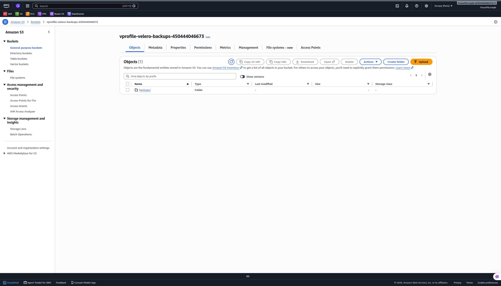

| | |
|---|---|
| Category | AWS / S3 · Backup |
| Evidence strength | **Verification** |
| Priority | P1 |

**Shown:** the `vprofile-velero-backups-450444046673` bucket containing a `backups/` prefix.

**Proves:** Velero's IRSA credentials **actually worked against S3**. This is the AWS-side
confirmation of the Kubernetes-side status in SS-060 — the two together close the loop. A backup
reporting `Completed` while nothing reached the bucket is a real and common failure mode
(mis-scoped `velero_s3_bucket_arns` produces exactly that), so this screenshot is not redundant
with SS-060.

**Does NOT prove:** the contents are restorable, complete, or non-corrupt. It shows one folder,
not object-level detail, sizes or counts.

**Related files:** `terraform/velero.tf`, `platform/values/velero.yaml`

> **Evidence summary:** This screenshot provides evidence that Velero's IRSA identity successfully wrote backup objects to its S3 bucket.

---

## SS-016 — Account S3 bucket inventory

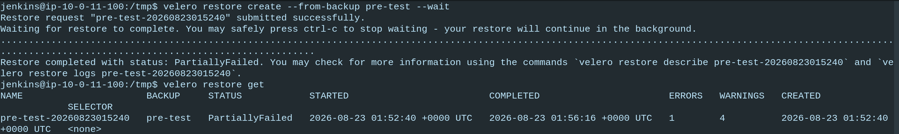

| | |
|---|---|
| Category | AWS / S3 |
| Evidence strength | Configuration |
| Priority | P2 |

**Shown:** three buckets — `vprofile-velero-backups-450444046673` (eu-west-3, created 22 Aug),
`vprofilealnaqib777` (eu-west-3, 11 Aug — the Terraform state backend), and `youseff` (eu-north-1,
unrelated).

**Proves:** the Velero bucket was created in the same region as the cluster, which matters because
Velero's `BackupStorageLocation` region must match or validation fails.

**Does NOT prove:** bucket-level configuration. Versioning, encryption, public-access block and the
lifecycle rule are all defined in `terraform/velero.tf` but **none are visible here**. Do not
caption this as evidence of a hardened bucket.

**Note for the record:** `vprofilealnaqib777` was the Terraform state backend and was later deleted
manually while the environment was still partially live, which broke `terraform destroy`. That
incident is documented in the troubleshooting mapping below.

> **Evidence summary:** This screenshot provides evidence that the backup bucket exists in the cluster's region, and incidentally records the state backend bucket.

---

# Category 04 — Jenkins CI/CD

## SS-020 — Complete pipeline, 11 stages including Deploy

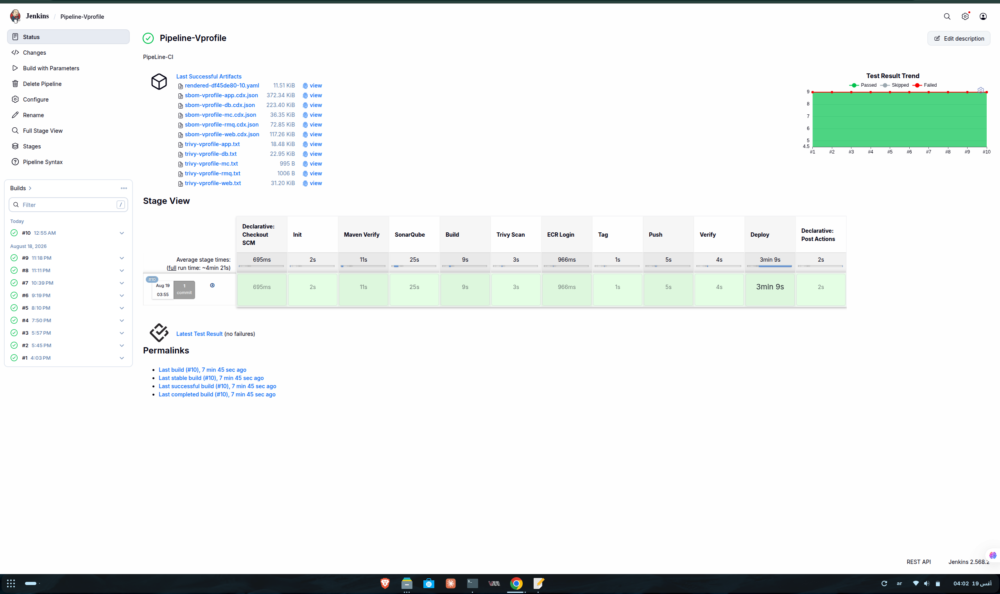

### Classification
| | |
|---|---|
| Category / Subcategory | CI/CD / Pipeline execution |
| Phase | Continuous delivery |
| Tool | Jenkins 2.568.2 (declarative pipeline) |
| Evidence strength | **Validation** |
| Priority | **P0** |

### What is shown
Job `Pipeline-Vprofile`, build **#10**, every stage green:

```
Checkout SCM → Init → Maven Verify → SonarQube → Build → Trivy Scan
→ ECR Login → Tag → Push → Verify → Deploy → Post Actions
```

Stage timings are visible: SonarQube 25s, Build 9s, Trivy Scan 3s, **Deploy 3min 9s**, total run
~4min 21s. Archived artifacts include five CycloneDX SBOMs (`sbom-vprofile-{app,db,mc,rmq,web}.cdx.json`),
five Trivy reports, and `rendered-df45de80-10.yaml`. The test trend shows 9 passing tests across
all 10 builds.

### What it proves
This is the **strongest single screenshot in the project**. It proves the complete supply chain
executed in one run:

| Stage | What it protects against |
|---|---|
| Maven Verify | Broken code reaching a container image |
| SonarQube | Quality/security regressions merging silently |
| Trivy Scan | Vulnerable images reaching the registry — runs **before** ECR Login by design |
| Tag / Push | Untraceable images; tags are `<git-sha>-<build>` |
| Verify | Pushing a manifest that does not exist in ECR |
| **Deploy** | Manual `kubectl apply` drift — deployment is `helm upgrade --install --atomic` |

The **archived SBOMs** matter more than they appear. Five CycloneDX documents per build means every
release has a machine-readable component inventory — the artifact you need when the next
Log4Shell-class CVE is published and someone asks "are we affected?"

The **`rendered-*.yaml` artifact** is the deployed manifest captured at deploy time, which makes
every release auditable after the fact.

### What it does NOT prove
- **Not** that the application works after deploy. `--atomic` means the release rolled out and readiness probes passed; SS-001 is what proves the app actually serves traffic.
- **Not** that the security gate is currently enforcing. During this project `--exit-code 1` was removed from the Trivy invocation to unblock progress, so `SECURITY_GATE=true` reports without failing the build despite the parameter description reading `ENFORCED`. **This screenshot must not be captioned as proof of an enforced vulnerability gate.** See the outstanding-items note in §11.
- **Not** the SonarQube quality gate result — only that the stage completed.
- **Not** that the deploy targeted production; this is a single lab cluster.

### Related repository files
```text
Jenkinsfile                                   (570 lines, 10 stages + post)
helm/vprofile/                                (chart deployed by the Deploy stage)
Build-Images/images/{app,db,memcached,rabbitmq}/
docker/web/
```

### Related documentation
`archive/Guides/CICD-PIPELINE-GUIDE/` — the 1,844-line reference for this Jenkinsfile.

### Interview questions this supports
1. Walk me through your CI/CD pipeline stage by stage.
2. Why does Trivy run before ECR login rather than after push?
3. What is an SBOM and why archive one per build?
4. How does Jenkins authenticate to EKS, and what permissions does it have?
5. What does `helm upgrade --install --atomic` do that `kubectl apply` does not?

**Security review:** Safe to publish. No credentials or tokens visible.

> **Evidence summary:** This screenshot provides evidence that a single pipeline run executed build, quality analysis, vulnerability scanning, SBOM generation, registry push and Helm deployment to EKS successfully.

---

## SS-021 — Build history: ten consecutive green builds

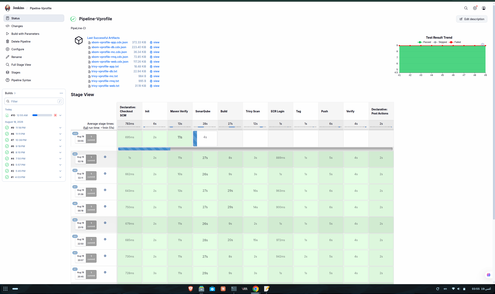

| | |
|---|---|
| Category | CI/CD |
| Evidence strength | Execution |
| Priority | P1 |

**Shown:** the same job with builds **#1 – #10** listed, all green in the sidebar, spanning
18–19 August. Average stage times are stable across runs (Maven Verify ~11s, SonarQube ~27s).
Build #10 is mid-execution — the Deploy column has not yet rendered.

**Proves: repeatability.** One green build can be luck; ten consecutive green builds with
consistent stage timings demonstrate a stable pipeline. The consistency of the timings is itself
evidence — wildly varying durations would suggest flakiness or resource contention.

**Does NOT prove:** that all ten builds included the Deploy stage. Comparing against SS-020 shows
Deploy was added during this sequence; earlier builds were CI-only.

**Pair with SS-020.** SS-021 shows *consistency*, SS-020 shows *completeness*. Together they are
considerably stronger than either alone.

> **Evidence summary:** This screenshot provides evidence that the pipeline executed successfully and consistently across ten builds.

---

## SS-022 — Early pipeline with failing builds

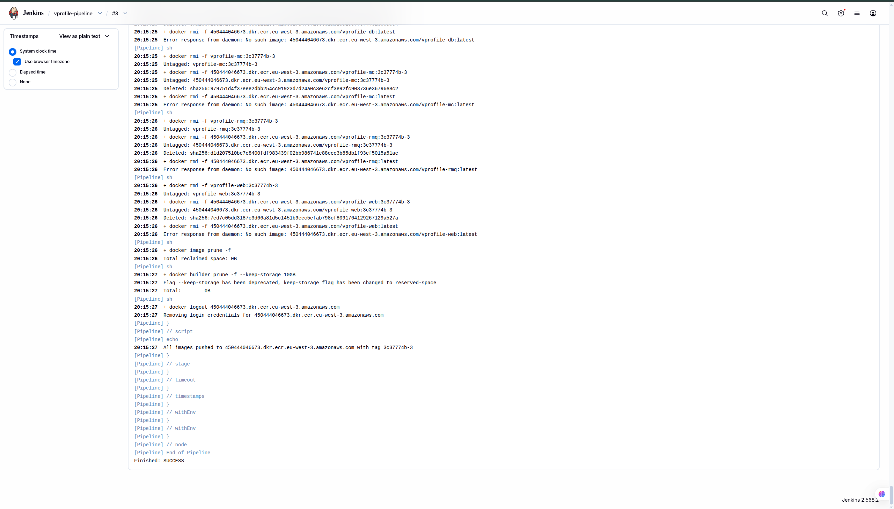

### Classification
| | |
|---|---|
| Category / Subcategory | CI/CD / Troubleshooting |
| Phase | Pipeline development |
| Evidence strength | Execution |
| Priority | P1 — *the most underrated screenshot in this set* |

### What is shown
An **earlier job**, `vprofile-pipeline`, dated 12 August — nine stages ending at **Verify**, with
**no Deploy stage**. Builds **#1 and #2 failed**: the red cells begin at SonarQube in #2 and at
Build in #1, and every downstream stage fails after them. Build **#3 succeeded** end to end.

### What it proves
Three things:

1. **The failure cascade is visible and correct.** When SonarQube fails in #2, every subsequent
   stage fails rather than being skipped or silently passing. That is the pipeline behaving as
   designed — a broken build must not reach ECR.
2. **The pipeline evolved.** This 9-stage CI-only version predates the 11-stage version in SS-020
   by a week. Placing them side by side documents genuine iteration.
3. **The evidence is honest.** Portfolios that show only green builds invite the question "did you
   ever actually break it?"

### Why this is worth publishing
Most candidates delete their failures. Showing a failed build **next to** the fixed one demonstrates
the debugging loop — *failure → investigation → fix → verification* — which is the actual job.
A reviewer who sees only successes learns nothing about how you handle the case that matters.

**Does NOT prove:** what specifically failed. The Stage View shows *where*, not *why*. The console
log for those builds was not captured, which is a gap worth noting.

### Interview questions this supports
1. Tell me about a time your pipeline broke. How did you diagnose it?
2. Why do downstream stages fail rather than skip when an upstream stage fails?
3. How did your pipeline change between these two versions and why?

> **Evidence summary:** This screenshot provides evidence that pipeline failures halt the delivery chain correctly, and documents the pipeline's evolution from a 9-stage CI job to an 11-stage CI/CD job.

---

## SS-023 — Console output: image push and credential cleanup

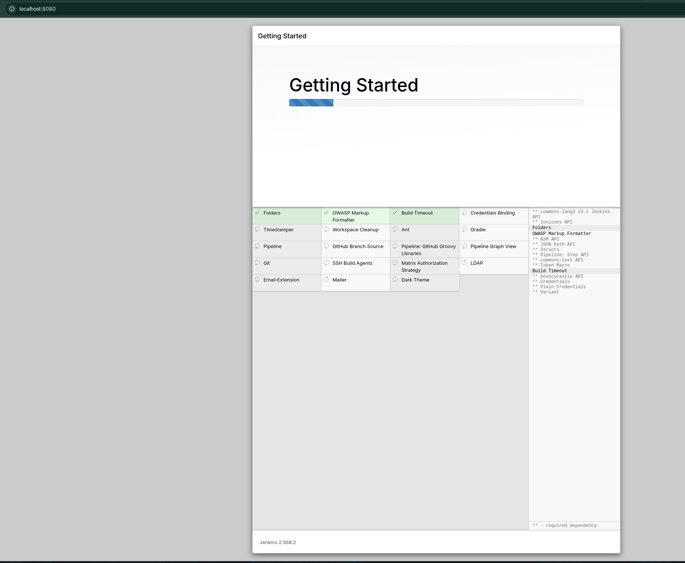

| | |
|---|---|
| Category | CI/CD |
| Evidence strength | Execution |
| Priority | P2 |

**Shown:** the tail of build #3's console log. Images are removed by digest, `docker image prune`
and `docker builder prune` run, and the log ends with:

```
docker logout 450444046673.dkr.ecr.eu-west-3.amazonaws.com
Removing login credentials for 450444046673.dkr.ecr.eu-west-3.amazonaws.com
All images pushed to 450444046673.dkr.ecr.eu-west-3.amazonaws.com with tag 3c37774b-3
Finished: SUCCESS
```

**Proves:** two operational disciplines that rarely get demonstrated —

1. **Immutable, traceable tags.** `3c37774b-3` is `<git-sha>-<build-number>`. Any running image traces to an exact commit.
2. **Credential hygiene in `post`.** `docker logout` runs unconditionally, so ECR credentials do not persist in `~/.docker/config.json` on a shared build host between builds.

The `No such image` errors are **expected and harmless** — the cleanup attempts to remove a `latest`
tag that is deliberately not created (`PUSH_LATEST=false`), and those commands are guarded with
`|| true`.

**Does NOT prove:** the images are secure, scanned, or reachable. Only that push completed and
cleanup ran.

**Caption carefully:** the visible `No such image` lines look like errors to a non-expert reviewer.
If used in a presentation, annotate them.

> **Evidence summary:** This screenshot provides evidence of commit-traceable image tagging and unconditional credential cleanup in the pipeline's post block.

---

## SS-024 — Jenkins initial setup screen

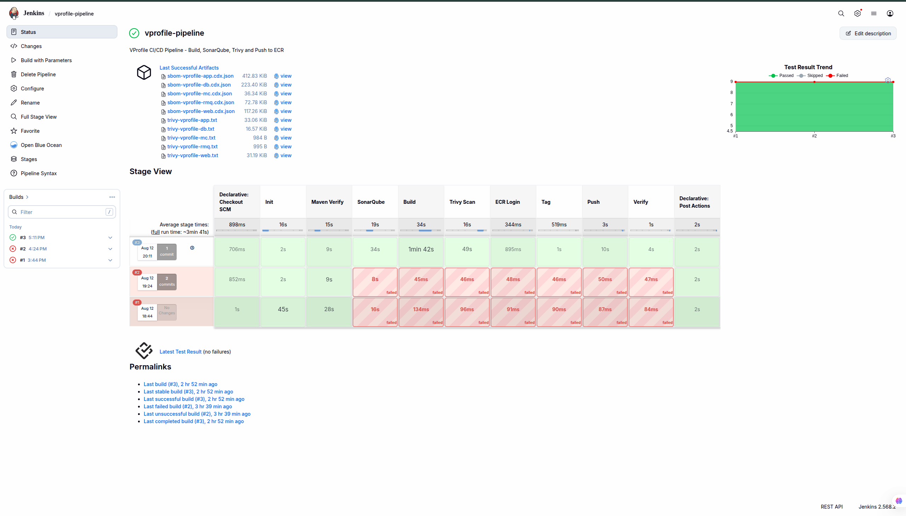

| | |
|---|---|
| Evidence strength | Configuration |
| Priority | **P4 — Redundant. Do not use.** |

**Shown:** the Jenkins "Getting Started" plugin installation screen at `localhost:8080`, Jenkins 2.568.2.

**Why it is rejected:** it proves only that Jenkins was installed, which SS-020, SS-021, SS-022 and
SS-023 all prove more strongly by showing Jenkins *doing work*. A first-run wizard is the least
informative possible screenshot of a CI system.

**Retain in the evidence archive** for completeness; exclude from README, guide, presentation and
portfolio.

> **Evidence summary:** This screenshot provides evidence only that Jenkins was installed, superseded entirely by SS-020 through SS-023.

---

# Category 05 — Compute

## SS-030 — Jenkins host: SonarQube container and Jenkins service

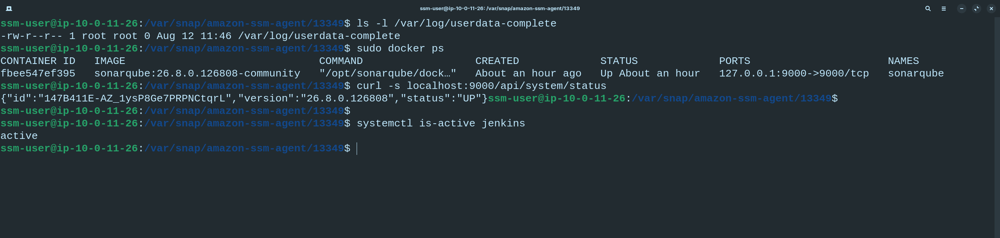

### Classification
| | |
|---|---|
| Category | Compute / EC2 |
| Phase | Infrastructure |
| Evidence strength | Runtime state |
| Priority | P1 |

### What is shown
An SSM session on `ip-10-0-11-26` running four verification commands:

```
ls -l /var/log/userdata-complete     → file exists (user-data finished)
sudo docker ps                       → sonarqube:26.8.0 Up About an hour, 127.0.0.1:9000->9000/tcp
curl localhost:9000/api/system/status → {"status":"UP"}
systemctl is-active jenkins          → active
```

### What it proves
Four independent facts, and the method is as noteworthy as the result:

1. **User-data completed.** The sentinel file confirms bootstrap ran to the end, not partway.
2. **SonarQube is healthy** — confirmed via its **API**, not by "the container is up". A container can be running while the application inside it is still starting or has failed.
3. **SonarQube is bound to `127.0.0.1:9000`, not `0.0.0.0`.** This is a deliberate security decision: the analysis server is reachable only from the Jenkins process on the same host, never from the network.
4. **Jenkins is running as a systemd service.**

The port binding is the detail worth pointing out in an interview. `127.0.0.1:9000->9000/tcp`
versus `0.0.0.0:9000->9000/tcp` is one character of difference and the entire difference between a
private analysis server and one exposed to the VPC.

### What it does NOT prove
- **Not** that the instance is in a private subnet (the `10.0.11.x` address suggests it, but the routing is not shown here).
- **Not** that SonarQube has any projects analysed or a quality gate configured.
- **Not** that SSM is the only access path — no evidence about SSH or security groups.

**Access method note:** the session is via **AWS Systems Manager**, not SSH. No bastion host, no
open port 22, no SSH key to manage. Worth stating explicitly whenever this screenshot is used.

### Related repository files
```text
terraform/jenkins-userdata.sh
terraform/ecr-jenkins.tf
```

### Interview questions this supports
1. How do you access instances in a private subnet without a bastion?
2. Why bind SonarQube to localhost rather than the instance IP?
3. Why check an HTTP health endpoint instead of trusting `docker ps`?

> **Evidence summary:** This screenshot provides evidence that both CI services are healthy on the Jenkins host, with SonarQube deliberately bound to loopback and access via SSM rather than SSH.

---

# Category 06 — Kubernetes

## SS-031 — Nodes Ready and system pods running

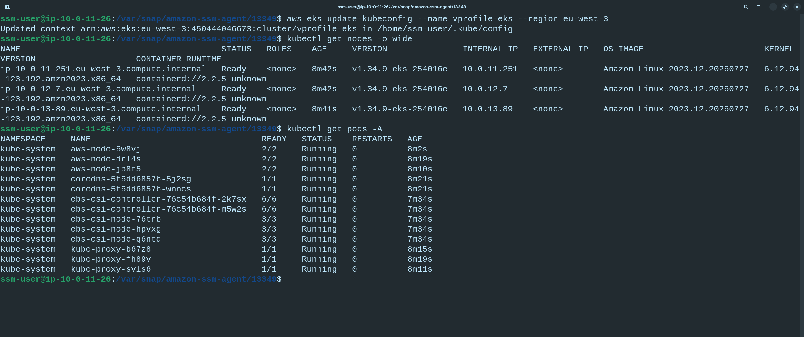

### Classification
| | |
|---|---|
| Category / Subcategory | Kubernetes / Cluster + Nodes |
| Phase | Deployment |
| Evidence strength | Runtime state |
| Priority | **P0** |

### What is shown
`aws eks update-kubeconfig` succeeding, then:

- **`kubectl get nodes -o wide`** — three nodes **Ready**, `v1.34.9-eks-254016e`, internal IPs `10.0.11.251`, `10.0.12.7`, `10.0.13.89`, **`EXTERNAL-IP <none>`**, Amazon Linux 2023, containerd 2.2.5.
- **`kubectl get pods -A`** — 14 `kube-system` pods, **all Running, 0 restarts**: `aws-node` ×3, `coredns` ×2, `ebs-csi-controller` ×2 (6/6 containers), `ebs-csi-node` ×3 (3/3), `kube-proxy` ×3.

### What it proves
1. **Nodes are in private subnets.** `EXTERNAL-IP <none>` combined with the `10.0.1x.x` addresses is direct evidence — the nodes have no public IP and are reachable only through the VPC.
2. **Nodes are spread across all three AZs** — `.11.`, `.12.`, `.13.` map to the three private subnets from SS-011. Terraform's subnet selection worked.
3. **The CNI is functional.** `aws-node` Running on all three nodes means pods can get IP addresses; without it every pod would be stuck `ContainerCreating`.
4. **Storage is ready.** `ebs-csi-controller` and `ebs-csi-node` Running is what allows the `gp3` StorageClass to bind PVCs — the precondition for MySQL, Prometheus, Grafana and Vault persistence.
5. **Zero restarts** across every system pod indicates a clean start rather than a crash-loop that eventually settled.

### What it does NOT prove
- **Not** that application workloads are running — `kube-system` only; the `vprofile` namespace does not appear in this capture.
- **Not** that the `gp3` StorageClass exists yet (the CSI driver being ready is necessary, not sufficient).
- **Not** that the cluster endpoint is private.
- **Not** that NetworkPolicy enforcement is active — the `enableNetworkPolicy` CNI setting is not visible here.

### Related repository files
```text
terraform/eks.tf
platform/bootstrap-addons.sh
```

### Interview questions this supports
1. How can you tell from this output that your nodes are in private subnets?
2. What is `aws-node` and what breaks without it?
3. Why does the EBS CSI controller need to be Running before you deploy a StatefulSet?
4. What would `0 restarts` versus `12 restarts` tell you about a system pod?

> **Evidence summary:** This screenshot provides evidence of three Ready nodes distributed across three AZs in private subnets, with CNI, DNS and storage drivers all healthy.

---

## SS-032 — Jenkins service account cluster access

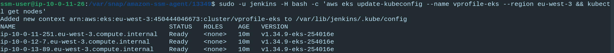

| | |
|---|---|
| Category | Kubernetes / RBAC · Access |
| Evidence strength | **Verification** |
| Priority | P1 |

**Shown:** a command run deliberately as another OS user —

```bash
sudo -u jenkins -H bash -c 'aws eks update-kubeconfig --name vprofile-eks --region eu-west-3 && kubectl get nodes'
```

— writing kubeconfig to `/var/lib/jenkins/.kube/config` and returning three Ready nodes.

**Proves:** the **`jenkins` user specifically** can authenticate to the cluster. This is the exact
identity the pipeline runs as. Verifying as `ssm-user` or `root` would have proven nothing about
whether builds can deploy — a distinction that causes real, confusing failures.

The separate kubeconfig path (`/var/lib/jenkins/.kube/config`, not `~/.kube/config`) also shows the
pipeline's cluster credentials are isolated from any operator's interactive session.

**Does NOT prove:** what the `jenkins` identity is *permitted* to do. `get nodes` is a read. The
actual grant is `AmazonEKSEditPolicy` **scoped to the `vprofile` namespace only**, defined in
`terraform/eks.tf`. Notably, under the final access design this command would **fail** — `get nodes`
is cluster-scoped and outside a namespace-scoped grant. This screenshot therefore captures an
**earlier, broader access configuration**.

**Do not caption this as evidence of least privilege.** It is evidence of connectivity verification,
and — read carefully — evidence of the *pre-tightening* state.

### Interview questions this supports
1. Why test as the `jenkins` user rather than as yourself?
2. What permissions does your CI system have on the cluster, and why that scope?
3. What would this command return under a namespace-scoped access policy?

> **Evidence summary:** This screenshot provides evidence that the Jenkins OS identity could authenticate to the EKS API, captured before namespace-scoped access was applied.

---

## SS-033 — Restored PVC labels and controlled teardown

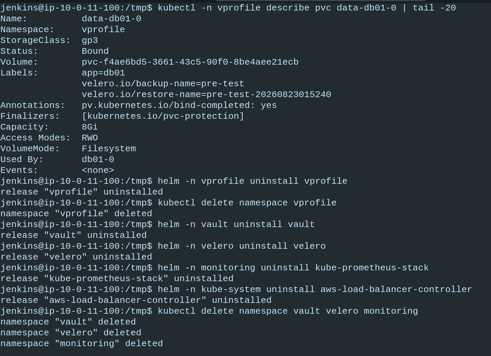

### Classification
| | |
|---|---|
| Category / Subcategory | Kubernetes / Storage · Disaster Recovery |
| Phase | DR verification + decommissioning |
| Evidence strength | **Verification** |
| Priority | P1 — *materially strengthens the DR evidence* |

### What is shown
Two sequences in one capture.

**First — `kubectl -n vprofile describe pvc data-db01-0`:**
```
StorageClass:  gp3
Status:        Bound
Volume:        pvc-f4ae6bd5-3661-43c5-90f0-8be4aee21ecb
Labels:        app=db01
               velero.io/backup-name=pre-test
               velero.io/restore-name=pre-test-20260823015240
Capacity:      8Gi
Used By:       db01-0
```

**Second — the teardown:** five `helm uninstall` commands and namespace deletions, all confirming.

### What it proves
This is the screenshot that **partially rescues the restore evidence**. The PVC carries
`velero.io/restore-name=pre-test-20260823015240` — labels Velero applies **only to objects it
restored**. Combined with `Status: Bound` and `Used By: db01-0`, this proves:

1. The MySQL PVC was **genuinely recreated by the restore**, not left over from before.
2. It **bound successfully** to a new EBS volume provisioned from the snapshot.
3. A pod **attached to it**.

That is meaningful recovery evidence for the single most important stateful component — and it is
independent of the `PartiallyFailed` overall status in SS-062.

The teardown sequence separately demonstrates a controlled decommissioning order: application
release first, then platform components, then namespaces.

### What it does NOT prove
- **Not** that the restored MySQL data is intact. The volume bound; **no query was run against it**. `SELECT COUNT(*)` before and after would have closed this, and it was not captured. **This is the single most valuable missing screenshot in the entire set.**
- **Not** that the `mysqldump` pre-backup hook produced a usable dump file — the `/var/lib/mysql/backup/dump.sql` listing was never captured.
- **Not** that the restore succeeded overall — SS-062 shows otherwise.

### Interview questions this supports
1. How do you tell a restored Kubernetes object from an original one?
2. Your restore reported PartiallyFailed — how did you determine what actually recovered?
3. What would you check next to confirm the database data itself survived?

> **Evidence summary:** This screenshot provides evidence that the database PVC was recreated and bound by a Velero restore, while leaving data integrity unverified.

---

# Category 07 — Vault / Secrets Management

> **Redaction policy applied to this section.** No Vault token, recovery key, unseal key or secret
> value appears in any screenshot below. SS-041 shows secret **keys** with values masked by the UI.
> A root token was used during this session and is flagged in SS-040.

## SS-040 — Vault dashboard: Raft storage and KV engine

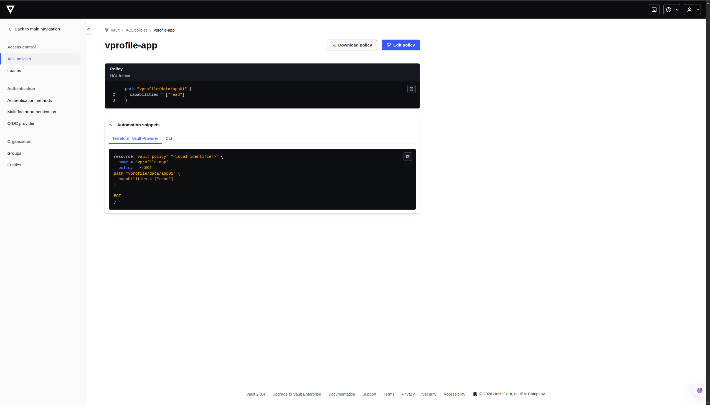

### Classification
| | |
|---|---|
| Category | Vault / Status |
| Evidence strength | Runtime state |
| Priority | P1 |

### What is shown
Vault **v2.0.4** dashboard. Secrets engines: `cubbyhole/` and **`vprofile/` (type `kv`, accessor
`kv_f215eafd`)**. Cluster information: **Storage type `raft`**, TLS **Disabled**, default and max
lease TTL 0. Sidebar shows Raft storage and Resilience and recovery sections. A warning toast reads:
*"You have logged in with a root token…"*

### What it proves
1. **Vault is unsealed and serving.** The UI would not render otherwise.
2. **Storage is Raft, not the chart's default `file` backend.** This is the deliberate choice that makes `vault operator raft snapshot` available — the only correct way to back up Vault. An EBS snapshot of a live Vault volume is not a Vault backup for the same reason it is not a MySQL backup.
3. **The KV v2 engine is mounted at `vprofile/`**, matching the policy path in SS-043.

### What it does NOT prove
- **Not** that auto-unseal works. The seal type is not on this view. It was configured as `awskms` with a KMS key from `terraform/vault.tf`, and the pod did unseal itself after restart — but **that evidence was not captured**.
- **Not** that any application consumes these secrets.

### ⚠️ Two items to note before publishing
- **`TLS: Disabled`** — accepted deliberately for a lab reached only by port-forward, with no Ingress. In any real environment this is unacceptable and should be stated as a known limitation, never presented as a finished configuration.
- **Root token warning** — a root token was used for configuration. Best practice is to revoke it immediately afterwards (`vault token revoke -self`) and regenerate via recovery keys when needed.

**Safe to publish** — no token value is displayed — **provided both limitations are captioned.**

### Interview questions this supports
1. Why Raft rather than the file backend for a single Vault pod?
2. How do you back up Vault, and why is an EBS snapshot insufficient?
3. What is wrong with `TLS: Disabled` and when is it tolerable?
4. What should happen to the root token after initial configuration?

> **Evidence summary:** This screenshot provides evidence that Vault is running unsealed on Raft storage with a KV v2 engine mounted, with TLS disabled as a documented lab limitation.

---

## SS-041 — Secret path `vprofile/app01`

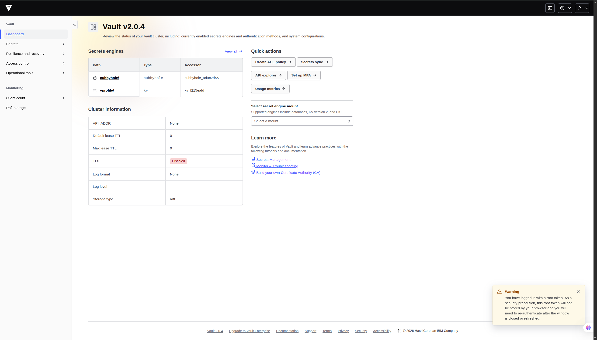

| | |
|---|---|
| Category | Vault / Secret paths |
| Evidence strength | Deployment |
| Priority | **P0** |

**Shown:** KV path `vprofile/data/app01` containing two keys — **`jdbc_password`** and
**`rabbitmq_password`** — both values rendered as `••••••••••`. Metadata: **Version 1 created
Aug 23, 2026**. Tabs for Metadata, Paths and Version History are present.

**Proves:** the application's two credentials are stored in Vault as versioned KV v2 secrets. The
key names match exactly what the policy in SS-043 grants and what the Helm chart expects.

Version History being available is the operational point: KV v2 retains previous versions, so a bad
rotation can be rolled back rather than recovered from someone's notes.

**Does NOT prove — and this is the important limitation:** that the **application reads these
values**. At the time of capture the application still consumed credentials from Kubernetes Secrets
(`db01-credentials`, `rmq01-credentials`). Vault is configured and populated but **not yet in the
application's runtime path**. Completing that requires Vault Agent Injector annotations on `app01`
and a NetworkPolicy egress rule permitting `vprofile → vault`, neither of which was implemented.

**This distinction must be stated wherever this screenshot appears.** "Secrets stored in Vault" is
accurate; "application secrets managed by Vault" is not yet.

**Security review: Safe to publish.** Values are masked by the UI. Key *names* are not sensitive —
they appear in the chart and policy in the public repository.

> **Evidence summary:** This screenshot provides evidence that both application credentials are stored as versioned Vault KV secrets, though not yet consumed by the application at runtime.

---

## SS-042 — ACL policy list

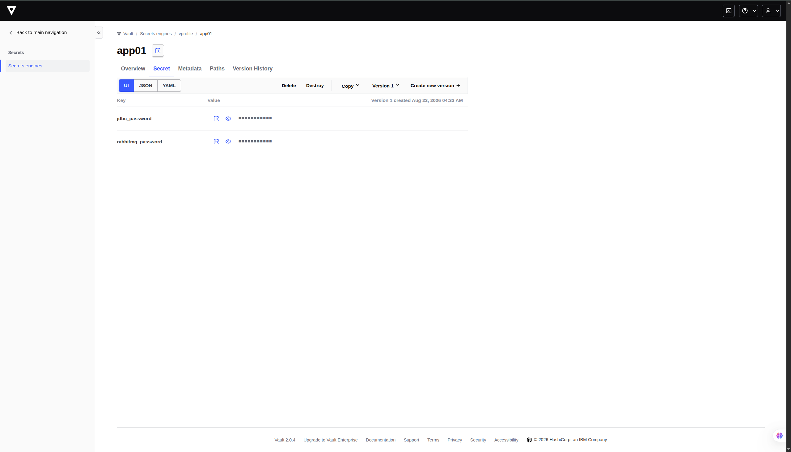

| | |
|---|---|
| Category | Vault / Policies |
| Evidence strength | Configuration |
| Priority | P2 |

**Shown:** four policies — `default`, `default-ceiling`, **`vprofile-app`**, and `root` (annotated
by Vault as *"does not contain any rules but can do anything within Vault"*).

**Proves:** exactly **one custom policy** was created. No sprawl, no accumulated experimental
policies. The absence of clutter is itself evidence of deliberate configuration.

**Does NOT prove:** what `vprofile-app` grants — SS-043 carries that.

**Supporting context for SS-043.** On its own this is a list; paired with SS-043 it shows that the
one custom policy in the system is a minimal one.

> **Evidence summary:** This screenshot provides evidence that a single purpose-built ACL policy was created alongside Vault's built-ins.

---

## SS-043 — Policy HCL: read on exactly one path

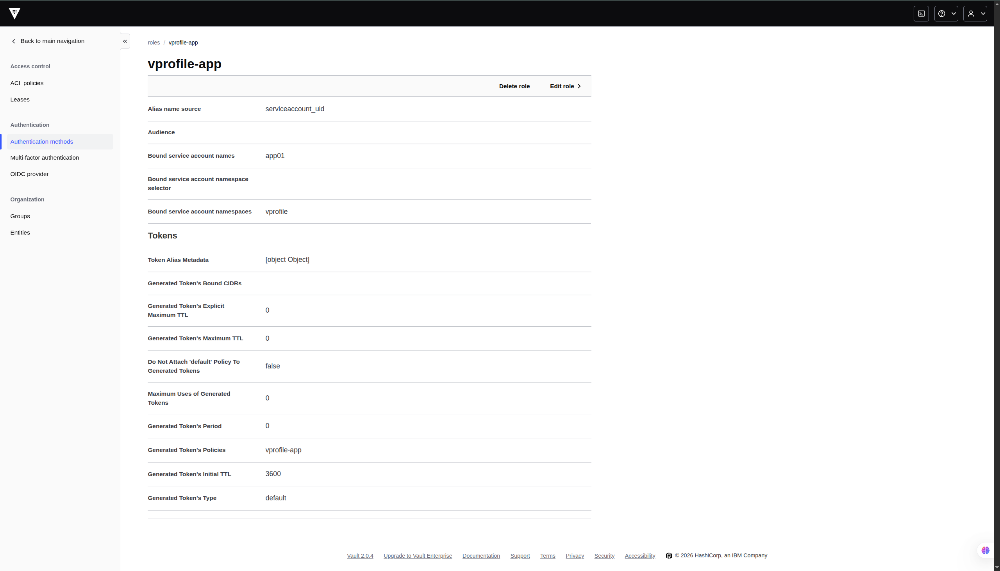

### Classification
| | |
|---|---|
| Category / Subcategory | Vault / Policies · Least privilege |
| Evidence strength | Configuration |
| Priority | **P0** |

### What is shown
The complete `vprofile-app` policy, three lines:

```hcl
path "vprofile/data/app01" {
  capabilities = ["read"]
}
```

Plus Vault's generated Terraform provider snippet and CLI equivalent.

### What it proves
**Least privilege made literal.** Every restriction is visible in three lines:

| Restriction | What it excludes |
|---|---|
| `vprofile/data/app01` — one exact path | Not `vprofile/*`, not a wildcard |
| `["read"]` only | No `create`, `update`, `delete`, `list`, or `sudo` |
| No `list` capability | The holder cannot even enumerate what other secrets exist |

The absence of `list` is the detail worth pointing out. A read-only policy that includes `list`
lets the holder discover the shape of your secret tree. This one does not.

**This is the most quotable screenshot in the project** — a security claim you can verify by
reading, in three lines, with nothing hidden.

### What it does NOT prove
- **Not** that the policy is attached to anything — SS-044 carries that.
- **Not** that the application uses it.

### Related repository files
```text
platform/vault-configure.sh     (the script that writes this policy)
```

### Interview questions this supports
1. Explain this policy line by line.
2. Why omit the `list` capability from a read-only policy?
3. How would this policy change if a second application needed a different secret?
4. Vault's Terraform snippet is shown — why was this scripted rather than managed in Terraform?

> **Evidence summary:** This screenshot provides evidence of a minimal Vault policy granting read on exactly one path with no list capability.

---

## SS-044 — Kubernetes auth role bound to `vprofile:app01`

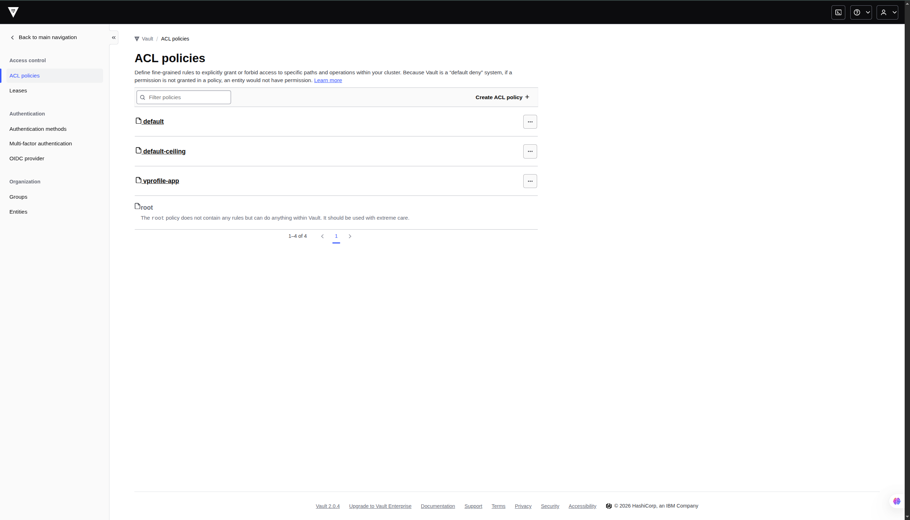

### Classification
| | |
|---|---|
| Category / Subcategory | Vault / Kubernetes integration |
| Phase | Security implementation |
| Evidence strength | **Validation** |
| Priority | **P0** |

### What is shown
The `vprofile-app` Kubernetes auth role:

| Field | Value |
|---|---|
| Alias name source | `serviceaccount_uid` |
| **Bound service account names** | **`app01`** |
| **Bound service account namespaces** | **`vprofile`** |
| Generated Token's Policies | `vprofile-app` |
| Generated Token's Initial TTL | `3600` |
| Generated Token's Type | `default` |

### What it proves
**The identity chain is complete and correctly scoped.** This closes the loop that all the
ServiceAccount work in this project existed to enable:

```
Pod runs as ServiceAccount app01 (namespace vprofile)
        ↓  presents its projected SA token
Vault validates it via the Kubernetes TokenReview API
        ↓  matches bound_service_account_names + namespaces
Role vprofile-app  →  policy vprofile-app  →  read on vprofile/data/app01
        ↓
Token issued with a 1-hour TTL
```

Two design points are visible and worth naming:

1. **`serviceaccount_uid` as alias source.** Vault identifies the caller by the ServiceAccount's UID, not its name. Delete and recreate `app01` and it gets a *new* UID — a stale token cannot be replayed against the recreated identity.
2. **1-hour TTL.** Credentials expire and must be renewed. There is no permanent token.

**Why the namespace binding matters so much:** before this project introduced per-workload
ServiceAccounts, every pod in `vprofile` ran as the namespace `default` ServiceAccount. A policy
written against `default` would have handed the database password to the nginx pods as well —
defeating the entire purpose of using Vault. This binding is what makes the narrow policy in
SS-043 meaningful rather than decorative.

### What it does NOT prove
- **Not** that authentication was tested. A successful `vault write auth/kubernetes/login` returning a token with `token_policies ["default" "vprofile-app"]` **was executed during this project but was not captured as a screenshot.** That is the second most significant gap in this evidence set.
- **Not** that a negative test was performed — confirming a *different* ServiceAccount (e.g. `vproweb`) is **rejected** would prove the isolation holds. Also not captured.
- **Not** that the application uses this path at runtime (see SS-041).

### Related repository files
```text
helm/vprofile/templates/05-serviceaccounts.yaml
platform/vault-configure.sh
terraform/vault.tf
```

### Interview questions this supports
1. How does a pod authenticate to Vault without any pre-shared secret?
2. What is the TokenReview API and what role does it play here?
3. Why bind by ServiceAccount UID rather than name?
4. What would happen if all your pods shared the `default` ServiceAccount?
5. How would you prove another workload *cannot* read this secret?

> **Evidence summary:** This screenshot provides evidence that Vault authentication is bound to a specific namespace and ServiceAccount pair with a scoped policy and expiring tokens.

---

# Category 08 — Monitoring / Observability

## SS-050 — Grafana: cluster compute resources, all namespaces

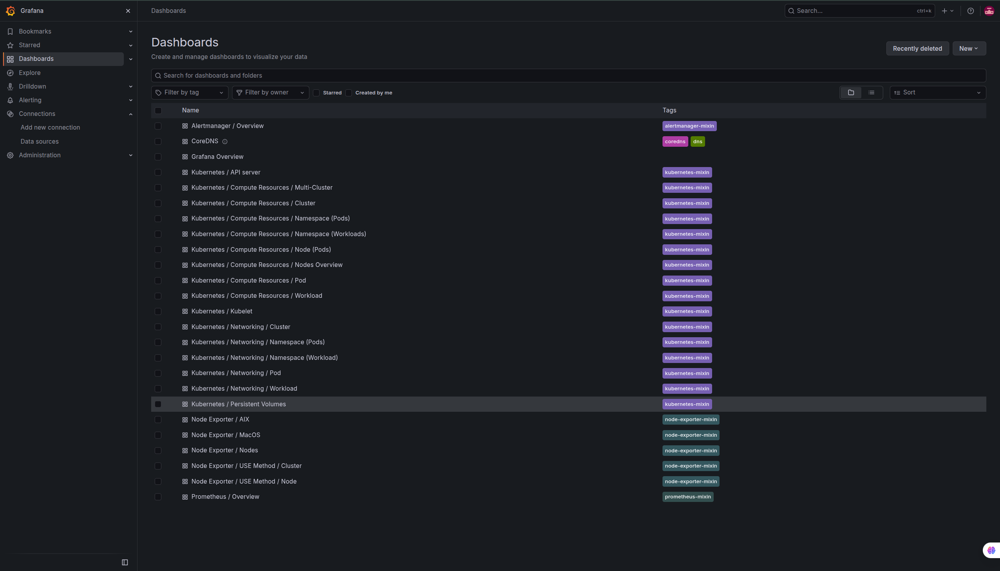

### Classification
| | |
|---|---|
| Category / Subcategory | Monitoring / Grafana dashboards |
| Phase | Observability |
| Evidence strength | Runtime state |
| Priority | **P0** |

### What is shown
The `Kubernetes / Compute Resources / Cluster` dashboard, 1-hour window, 10s refresh.

Headline stats: **CPU Utilisation 3.58%**, CPU Requests Commitment **42.9%**, Memory Utilisation
**19.5%**, Memory Requests Commitment **26.7%**, Memory Limits Commitment **64.4%**.

Per-namespace breakdown with live series for **`kube-system`, `monitoring`, `velero`, `vault`, `vprofile`** —
all five namespaces reporting. The CPU Quota and Memory Requests tables give pod counts and
utilisation per namespace (`kube-system` 14 pods / 380 MiB, `monitoring` 8 pods / 809 MiB,
`vprofile` visible in the graph legend at 960 MiB, `vault` 2 pods / 35.6 MiB, `velero` 1 pod / 20.9 MiB).

### What it proves
1. **The full monitoring chain works end to end**: kube-state-metrics and node-exporter export → Prometheus scrapes → Grafana queries and renders. Any break anywhere produces empty panels.
2. **Every namespace is being scraped**, including the application namespace — confirming `serviceMonitorSelectorNilUsesHelmValues: false` had the intended effect of discovering targets beyond the monitoring release's own.
3. **Capacity headroom is quantified.** 42.9% CPU requests and 64.4% memory limits commitment on 3× m7i-flex.large means the cluster is comfortably provisioned but not wastefully so — a real number to cite rather than an impression.
4. Data is present across the whole window, not a single scrape.

### What it does NOT prove
- **Not** that alerting works. Prometheus rules exist, but **Alertmanager has no receivers configured** — alerts fire and go nowhere. This is a documented gap in `platform/bootstrap-addons.sh`, not an oversight. **Never caption this as "monitoring and alerting".**
- **Not** application-level metrics. These are infrastructure metrics only; the Java application exposes no JVM or business metrics.
- **Not** log aggregation — no Loki or Fluent Bit is deployed.
- **Not** long-term trends — retention is 7 days.

### Related repository files
```text
platform/values/monitoring.yaml
platform/bootstrap-addons.sh
```

### Interview questions this supports
1. Walk me through how a metric gets from a pod to this dashboard.
2. What does "Memory Limits Commitment 64.4%" tell you, and what would you do at 130%?
3. Why did you disable etcd, controller-manager, scheduler and kube-proxy scraping on EKS?
4. You have dashboards — do you have alerting? What is the difference?

**Security review:** Safe to publish. Infrastructure metrics only; no hostnames or business data.

> **Evidence summary:** This screenshot provides evidence that Prometheus is scraping all five namespaces and Grafana is rendering live cluster resource metrics.

---

## SS-051 — Grafana: `vprofile` namespace, per-pod resources

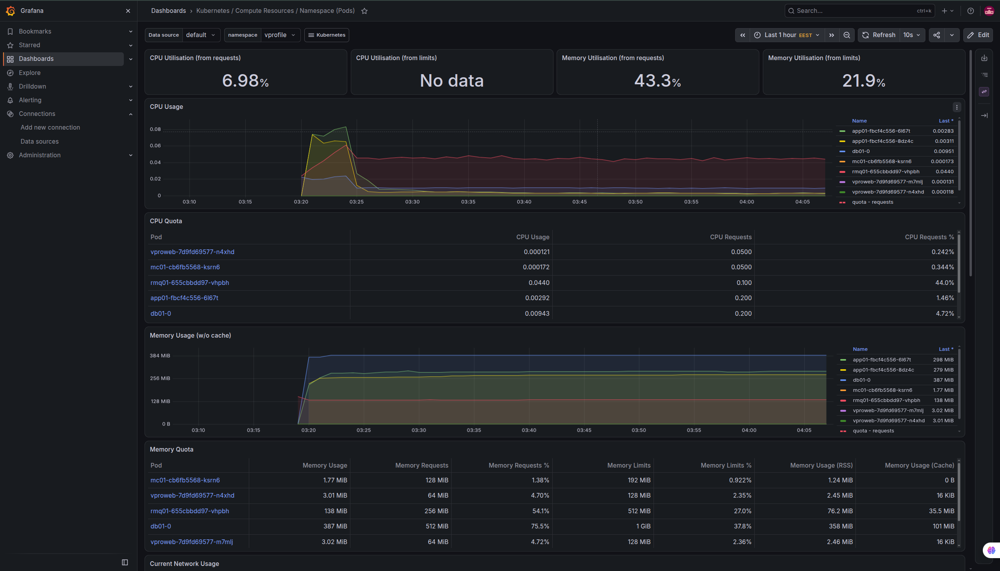

### Classification
| | |
|---|---|
| Category | Monitoring / Application observability |
| Evidence strength | Runtime state |
| Priority | **P0** |

### What is shown
`Kubernetes / Compute Resources / Namespace (Pods)` filtered to **namespace `vprofile`**. Seven
application pods named individually:

```
app01-fbcf4c556-6l67t     app01-fbcf4c556-8dz4c      (2 replicas)
vproweb-7d9fd69577-m7mlj  vproweb-7d9fd69577-n4xhd   (2 replicas)
db01-0                    mc01-cb6fb5568-ksrn6       rmq01-655cbbdd97-vhpbh
```

Memory Quota table with usage against requests and limits: `db01-0` 387 MiB / 512 MiB requested
(**75.5%**) with a 1 GiB limit (37.8%); `rmq01` 138 MiB / 256 MiB (**54.1%**); `app01` ~298 MiB
each; `vproweb` 3 MiB each; `mc01` 1.77 MiB. CPU Utilisation from requests **6.98%**; from limits
reads **No data**.

### What it proves
1. **The application's own workloads are observable at pod granularity** — not just cluster totals.
2. **Every pod has resource requests set.** The percentages could not be calculated otherwise. Requests are what the scheduler uses; without them pods are `BestEffort` and evicted first under pressure.
3. **Replica counts are visible and correct** — `app01` and `vproweb` at 2 each, matching the chart and the PodDisruptionBudgets.
4. **Right-sizing evidence.** `db01` at 75.5% of requests is well-tuned; `vproweb` at 3 MiB against a 64 MiB request is over-provisioned — a specific, actionable finding this dashboard surfaces.

### What it does NOT prove
- **Not** that the application is functioning correctly. These are container-level resource metrics. A pod can consume memory normally while returning HTTP 500 to every request. **SS-001 is what proves the application works** — this proves it is *measurable*.
- **Not** request rates, error rates or latency. No RED metrics; the app exposes no application-level instrumentation.

**On `CPU Utilisation (from limits): No data`** — this is expected, not a fault. The chart sets
memory limits but deliberately omits CPU limits on most containers, so the panel has no denominator.
CPU limits cause throttling; memory limits prevent node exhaustion. Omitting CPU limits while
setting requests is a defensible, common choice — and this panel is the visible consequence.

### Interview questions this supports
1. What does this dashboard tell you that `kubectl top pods` does not?
2. `db01` is at 75% of its memory request — is that good or bad?
3. Why is "CPU Utilisation from limits" showing No data?
4. Which pod here is over-provisioned, and how would you correct it?

> **Evidence summary:** This screenshot provides evidence that all seven application pods are individually observable with resource requests correctly configured.

---

## SS-052 — Grafana: nodes overview

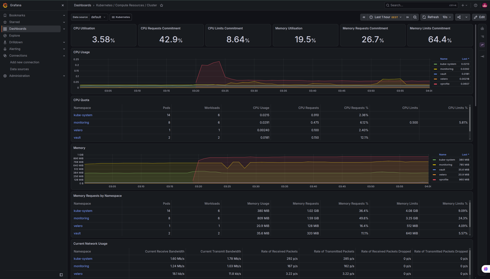

| | |
|---|---|
| Category | Monitoring / Node metrics |
| Evidence strength | Runtime state |
| Priority | P1 |

**Shown:** `Kubernetes / Compute Resources / Nodes Overview` over a **6-hour** window. Node & Pod
Count rises from 3 nodes / ~24 pods to 3 nodes / **32 pods** around 03:15. CPU allocatable **5.79**
cores against requests **2.49** and usage **0.133**; Memory allocatable **20.8 GiB**, requests
**5.55 GiB**, usage **2.63 GiB**. Per-node CPU utilisation: 3.52%, 1.99%, 1.40%.

**Proves:**
1. **`node-exporter` is functioning on all three nodes** — a different data source from kube-state-metrics, so this validates a second collection path.
2. **The platform rollout is visible as a step change.** The jump from 24 to 32 pods at 03:15 is the monitoring, Velero and Vault components being installed. The dashboard captured its own deployment.
3. **Requests exceed usage by roughly 20×** (2.49 cores requested, 0.133 used) — quantified evidence of conservative request sizing, which is the correct trade-off for a small cluster but worth knowing.

**Does NOT prove:** node health beyond resources — no disk pressure, network errors or kubelet
status shown. Nor does it prove nodes are correctly labelled or tainted.

**The step change is the interesting feature.** A dashboard that shows the moment your platform was
installed is more compelling than a flat line.

> **Evidence summary:** This screenshot provides evidence that node-exporter reports across all three nodes, capturing the platform rollout as a visible step change in pod count.

---

## SS-053 — Grafana dashboard inventory

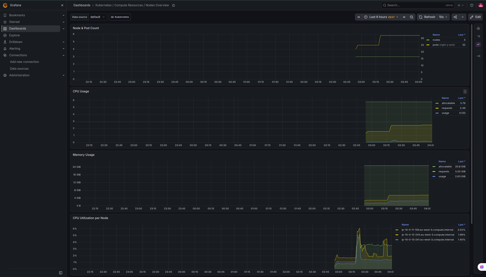

| | |
|---|---|
| Category | Monitoring / Grafana provisioning |
| Evidence strength | Deployment |
| Priority | P2 |

**Shown:** **24 dashboards**, tagged by source mixin — `kubernetes-mixin` (14), `node-exporter-mixin`
(5), `prometheus-mixin`, `alertmanager-mixin`, `coredns`/`dns`, plus Grafana Overview.

**Proves:** dashboards were **provisioned automatically** by the Helm chart, not imported by hand.
`defaultDashboardsEnabled: true` in the values file produced all 24. This is reproducibility — a
rebuilt cluster gets the identical set with no manual step.

**Does NOT prove:** that any of them contain data. SS-050, SS-051 and SS-052 prove three of the 24
are populated; the remaining 21 are unverified. **Do not caption this as "24 working dashboards".**

**Note:** the `alertmanager-mixin` dashboard exists, which reinforces the point in SS-050 —
Alertmanager is deployed and observable, but has **no receivers**, so nothing is delivered.

> **Evidence summary:** This screenshot provides evidence that 24 dashboards were automatically provisioned by the monitoring chart, three of which are independently verified as populated.

---

# Category 09 — Velero / Backup & Disaster Recovery

> ### Evidence-strength statement for this section
>
> The distinction below is enforced strictly throughout, because conflating these four is the most
> common inaccuracy in DevOps portfolios:
>
> ```
> Backup Configured  ≠  Backup Successful  ≠  Restore Tested  ≠  DR Validated
> ```
>
> | Level | Status in this project | Evidence |
> |---|---|---|
> | Backup Configured | ✅ Achieved | SS-016, `platform/values/velero.yaml` |
> | Backup Successful | ✅ Achieved | SS-060, SS-061, SS-015 |
> | Restore Tested | ⚠️ **Attempted — PartiallyFailed** | SS-062 |
> | DR Validated | ❌ **Not achieved** | — |
>
> **No screenshot in this project supports a claim of validated disaster recovery.** The restore
> executed and recovered the database PVC (SS-033), but reported 1 error and 4 warnings, and no data
> integrity check was performed. Any README, presentation or CV claiming "disaster recovery tested
> and validated" would be unsupported by this evidence.

## SS-060 — Backup completed

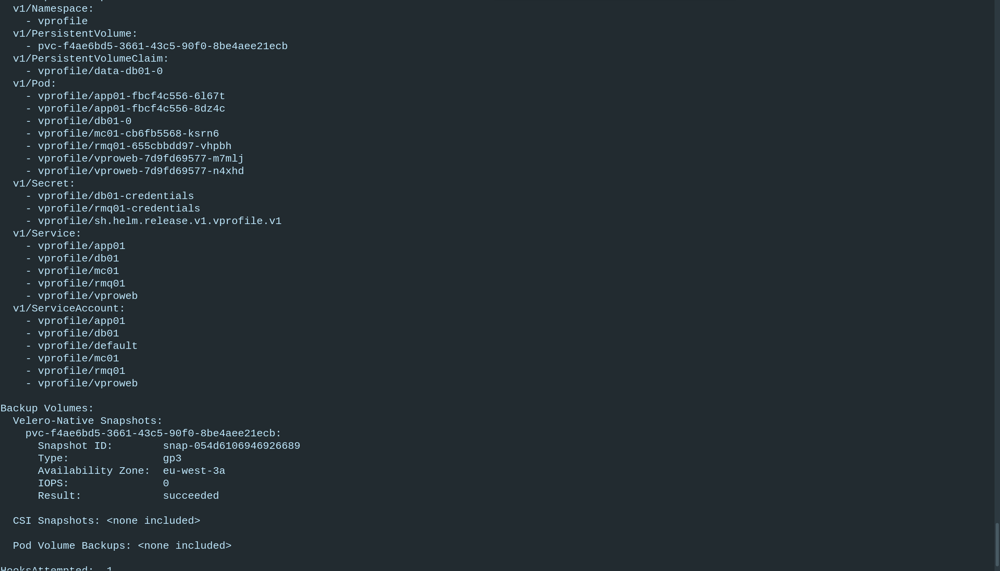

| | |
|---|---|
| Category | Velero / Backup execution |
| Evidence strength | Execution |
| Priority | **P0** |

**Shown:**
```bash
velero backup create pre-test --include-namespaces vprofile --wait
Backup request "pre-test" submitted successfully.
Backup completed with status: Completed.

velero backup describe pre-test | grep -E "Phase|Errors|Warnings"
Phase:  Completed
```

**Proves:** the backup ran to completion. The filtered `describe` output showing **only** `Phase:
Completed` — with no `Errors:` or `Warnings:` lines matching the grep — indicates a clean run.

**Does NOT prove:** that anything is restorable. `Completed` describes the backup *operation*, not
the recoverability of its output. SS-061 shows what was captured; SS-062 shows what happened when
recovery was attempted.

**Related files:** `platform/values/velero.yaml`, `terraform/velero.tf`

> **Evidence summary:** This screenshot provides evidence that a Velero backup of the vprofile namespace completed without errors or warnings.

---

## SS-061 — Backup contents and EBS snapshot

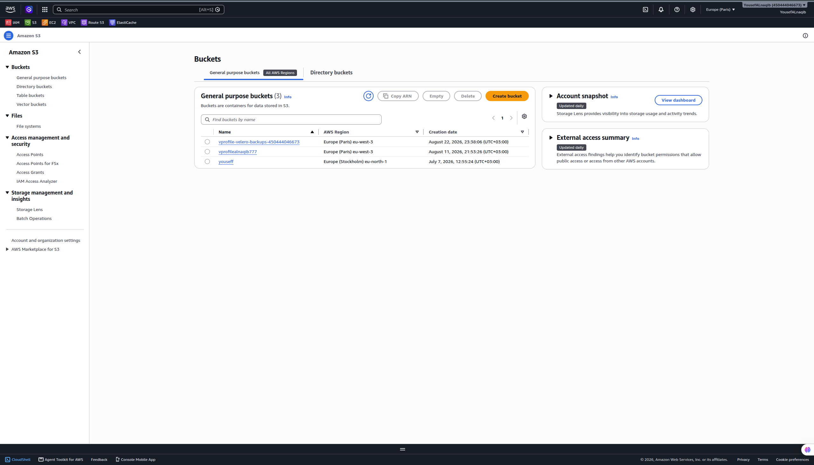

### Classification
| | |
|---|---|
| Category | Velero / Backup detail |
| Evidence strength | **Verification** |
| Priority | **P0** |

### What is shown
`velero backup describe pre-test --details` — the captured resource inventory:

| Kind | Captured |
|---|---|
| Namespace | `vprofile` |
| PersistentVolume | `pvc-f4ae6bd5-3661-43c5-90f0-8be4aee21ecb` |
| PersistentVolumeClaim | `vprofile/data-db01-0` |
| Pod | 7 — `app01` ×2, `db01-0`, `mc01`, `rmq01`, `vproweb` ×2 |
| Secret | `db01-credentials`, `rmq01-credentials`, `sh.helm.release.v1.vprofile.v1` |
| Service | `app01`, `db01`, `mc01`, `rmq01`, `vproweb` |
| ServiceAccount | `app01`, `db01`, `default`, `mc01`, `rmq01`, `vproweb` |

**Backup Volumes → Velero-Native Snapshots:**
```
pvc-f4ae6bd5-…: Snapshot ID: snap-054d6106946926689
                Type: gp3   AZ: eu-west-3a   Result: succeeded
```
CSI Snapshots: none. Pod Volume Backups: none. **`HooksAttempted: 1`**.

### What it proves
1. **The EBS snapshot succeeded** — `Result: succeeded` with a real snapshot ID. This is the actual database data, not just Kubernetes objects.
2. **The complete application state was captured** — workloads, services, secrets **and the Helm release secret** (`sh.helm.release.v1.vprofile.v1`), which means Helm's own view of the release is recoverable, not just the raw objects.
3. **The six per-workload ServiceAccounts were captured** — the identity work from the Vault section is included in the backup.
4. **`HooksAttempted: 1`** — the pre-backup `mysqldump` hook on `db01` was **triggered**.

### What it does NOT prove — read carefully
- **`HooksAttempted: 1` means attempted, not succeeded.** The corresponding `HooksSucceeded` / `HooksFailed` counters are **cut off below the visible area**. The hook ran; whether it produced a valid `/var/lib/mysql/backup/dump.sql` is **not shown**. A `kubectl exec db01-0 -- ls -lh /var/lib/mysql/backup/` was never captured — this is a **significant gap**, because the hook is precisely what elevates the snapshot from crash-consistent to application-consistent.
- **Not** that the snapshot is restorable — a snapshot can succeed and still contain a torn write.
- **Not** that any data inside the volume is correct.

**On why the hook is a `mysqldump` and not `FLUSH TABLES WITH READ LOCK`:** the lock releases the
moment the hook's session ends, which is *before* the snapshot is taken. The dump writes a
known-good logical export into the volume so the snapshot captures both. This is a common and
subtle mistake, and this screenshot is the evidence the correct approach was implemented.

### Interview questions this supports
1. What is the difference between a crash-consistent and an application-consistent backup?
2. Why not use `FLUSH TABLES WITH READ LOCK` in a Velero pre-hook?
3. Why does backing up the Helm release secret matter?
4. `HooksAttempted: 1` — what would you check next?

> **Evidence summary:** This screenshot provides evidence that 25 Kubernetes objects and a successful EBS snapshot were captured, with the pre-backup hook attempted but its outcome not visible.

---

## SS-062 — Restore: PartiallyFailed

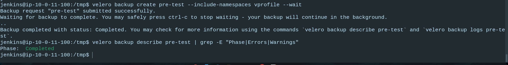

### Classification
| | |
|---|---|
| Category / Subcategory | Velero / Restore · **Troubleshooting** |
| Phase | Disaster recovery testing |
| Evidence strength | Execution — *negative result* |
| Priority | **P0 — the most valuable screenshot in this set for interview purposes** |

### What is shown
```bash
velero restore create --from-backup pre-test --wait
Restore request "pre-test-20260823015240" submitted successfully.
Restore completed with status: PartiallyFailed.

velero restore get
NAME                      BACKUP     STATUS           STARTED               COMPLETED             ERRORS  WARNINGS
pre-test-20260823015240   pre-test   PartiallyFailed  2026-08-23 01:52:40   2026-08-23 01:56:16   1       4
```

Duration: **3 minutes 36 seconds**. **1 error, 4 warnings.**

### What it proves
1. **A restore was genuinely attempted** — against a namespace that had been deleted, not a dry run.
2. **Velero read the backup from S3 and reconstructed resources** — the restore ran for 3.5 minutes and reached a terminal state, meaning it was processing real objects.
3. **Combined with SS-033**, the database PVC was recreated, bound and attached — the most important stateful component did recover.

### What it does NOT prove — and this is the entire point
- ❌ **Disaster recovery is NOT validated.** `PartiallyFailed` is a failure state, not a qualified success.
- ❌ **The specific error is unknown.** `velero restore describe pre-test-20260823015240 --details` and `velero restore logs …` would identify it and **were not captured**.
- ❌ **The 4 warnings are unexamined.**
- ❌ **No data integrity check was performed** — no row count, no application smoke test after restore.

### Probable causes — stated as hypotheses, not findings
Based on the restore's own configuration, the most likely candidates are:

| Candidate | Reasoning |
|---|---|
| Immutable field conflicts | Restoring a StatefulSet or Service into a namespace where a field cannot be updated in place |
| ClusterIP reassignment | Services are restored with their original ClusterIP, which may already be allocated |
| Helm release secret collision | `sh.helm.release.v1.vprofile.v1` restored while Helm state exists |
| Webhook interference | Admission webhooks rejecting a restored object |

**These are hypotheses. Without the restore logs, no root cause can be stated.** This register does
not fabricate one.

### Why this belongs in the portfolio rather than being hidden
A restore that partially failed, **documented honestly with its limitations named**, is stronger
evidence of engineering maturity than a backup screenshot alone. It demonstrates:

- You **tested** your backup rather than assuming it worked.
- You can **read a failure state accurately** instead of rounding it up to success.
- You know **precisely what evidence is missing** and what you would gather next.

The reviewer who matters will trust the rest of your documentation more because this entry exists.

### What should have been captured
```bash
velero restore describe pre-test-20260823015240 --details
velero restore logs pre-test-20260823015240 | grep -iE "error|warn"
kubectl -n vprofile get pods,pvc,svc
kubectl -n vprofile exec db01-0 -- mysql -uroot -p"$MYSQL_ROOT_PASSWORD" \
  accounts -e "SELECT COUNT(*) FROM user;"
```
The last command, run **before and after**, is the one that would have converted this from
"restore attempted" to "data recovery verified".

### Interview questions this supports
1. Your restore reported PartiallyFailed — walk me through how you would diagnose it.
2. What is the difference between backup tested and disaster recovery validated?
3. What did recover, and how do you know?
4. Which single command would have made this evidence conclusive?
5. Why show a failed restore in your portfolio at all?

**Security review:** Safe to publish.

> **Evidence summary:** This screenshot provides evidence that a restore was executed against a deleted namespace and reached a PartiallyFailed state with one error and four warnings, leaving disaster recovery unvalidated.

---

# Screenshot → Documentation Mapping

```text
SS-001  Application running
          └─► README (hero image) ─► PPT slide 12 ─► LinkedIn post 1

SS-014  EKS cluster Active
SS-010  VPC resource map
SS-012  NAT ×3
          └─► README §Architecture ─► GUIDE §2 Infrastructure ─► PPT slide 4

SS-031  Nodes + system pods
          └─► README §Verification ─► GUIDE §3 Kubernetes ─► PPT slide 5

SS-020  Pipeline 11 stages
SS-021  Ten green builds
SS-023  Push + cleanup
          └─► README §CI/CD ─► GUIDE §4 Pipeline ─► PPT slide 7 ─► INTERVIEW Q1–Q5

SS-022  Failed builds
          └─► TROUBLESHOOTING #01 ─► INTERVIEW "tell me about a failure"

SS-030  Jenkins host services
SS-032  Jenkins cluster access
          └─► GUIDE §4.1 CI host ─► TROUBLESHOOTING #02

SS-043  Vault policy HCL
SS-044  Vault K8s auth role
SS-041  Vault KV secret
SS-040  Vault dashboard
SS-042  Policy list
          └─► README §Security ─► GUIDE §6 Secrets ─► PPT slide 10 ─► INTERVIEW Q6–Q10

SS-050  Grafana cluster
SS-051  Grafana vprofile pods
SS-052  Grafana nodes
SS-053  Dashboard inventory
          └─► README §Observability ─► GUIDE §7 Monitoring ─► PPT slide 11 ─► LinkedIn post 2

SS-060  Backup Completed
SS-061  Backup contents + snapshot
SS-015  S3 objects
          └─► README §Backup ─► GUIDE §8 DR ─► PPT slide 13

SS-062  Restore PartiallyFailed
SS-033  Restored PVC labels
          └─► TROUBLESHOOTING #03 ─► GUIDE §8.3 Known limitations ─► INTERVIEW Q11–Q15
```

---

# Screenshot → Architecture Mapping

```text
AWS
├── VPC ─────────────────── SS-010
│   ├── Subnets ─────────── SS-011
│   ├── NAT gateways ────── SS-012
│   └── Route tables ────── SS-013
├── EKS ─────────────────── SS-014, SS-031
├── EC2 (Jenkins) ───────── SS-030
├── S3 ──────────────────── SS-015, SS-016
├── ECR ─────────────────── (no direct screenshot — inferred from SS-023)
└── IAM / IRSA ──────────── (no direct screenshot — inferred from SS-014, SS-015)

CI/CD
├── Jenkins pipeline ────── SS-020, SS-021, SS-023
├── Pipeline failures ───── SS-022
├── SonarQube ───────────── SS-030 (service health only, no analysis view)
└── Trivy ───────────────── (no direct screenshot — artifacts listed in SS-020)

Kubernetes
├── Nodes ───────────────── SS-031
├── System pods ─────────── SS-031
├── Application pods ────── SS-051 (via Grafana)
├── PVC / Storage ───────── SS-033
├── ServiceAccounts ─────── SS-061 (via backup inventory)
├── Ingress / ALB ───────── SS-001 (indirect, via hostname)
└── NetworkPolicies ─────── ❌ no evidence

Security
├── Vault status ────────── SS-040
├── Vault policy ────────── SS-043
├── Vault K8s auth ──────── SS-044
├── Vault secrets ───────── SS-041, SS-042
└── EKS access control ──── SS-032 (pre-tightening state only)

Monitoring
├── Grafana dashboards ──── SS-050, SS-051, SS-052, SS-053
├── Prometheus ──────────── (no UI screenshot — proven indirectly by SS-050)
└── Alerting ────────────── ❌ no receivers configured

Backup & DR
├── Backup execution ────── SS-060
├── Backup contents ─────── SS-061
├── S3 storage ──────────── SS-015
├── Restore attempt ─────── SS-062
└── Restore verification ── SS-033 (partial — PVC only)
```

---

# Screenshot → Troubleshooting Mapping

## Incident #01 — Pipeline stages failing before ECR

```text
Failure evidence:      SS-022  (builds #1, #2 red from SonarQube/Build onward)
Investigation:         Stage View identifies the first failing stage; downstream
                       cascade confirms the pipeline halts correctly
Verification evidence: SS-020, SS-021  (11 stages green, ten consecutive builds)
Status:                ✅ Resolved — failure and fix both documented
```

## Incident #02 — Jenkins identity could not reach the EKS API

```text
Failure evidence:      ❌ not captured
Investigation:         SS-032 — verification run as the `jenkins` user specifically,
                       writing kubeconfig to /var/lib/jenkins/.kube/config
Verification evidence: SS-032 (three nodes Ready), SS-020 (Deploy stage succeeded)
Status:                ✅ Resolved — but only the "after" state exists
Note:                  SS-032 reflects the pre-tightening access configuration; under
                       the final namespace-scoped EKSEditPolicy, `get nodes` would fail
```

## Incident #03 — Velero restore PartiallyFailed

```text
Failure evidence:      SS-062  (1 error, 4 warnings, 3m36s)
Investigation:         ❌ INCOMPLETE — restore logs and describe --details not captured
Partial recovery:      SS-033  (PVC bound, carries velero.io/restore-name label)
Root cause:            ⚠️ UNKNOWN — hypotheses listed in SS-062, none confirmed
Verification evidence: ❌ none — no data integrity check performed
Status:                🔴 OPEN — the most significant open item in this project
Next step:             velero restore logs pre-test-20260823015240 | grep -iE "error|warn"
```

## Incident #04 — Terraform state bucket deleted before destroy completed

```text
Context evidence:      SS-016  (shows `vprofilealnaqib777`, the state backend)
What happened:         The state bucket was deleted manually from the console while
                       infrastructure still existed, causing `terraform destroy` to fail
                       with NoSuchBucket
Impact:                Terraform lost its resource map; remaining cleanup was manual
Lesson:                Delete the state backend LAST, only after destroy completes and
                       is verified
Status:                ✅ Resolved manually — account confirmed clean
Failure evidence:      ❌ the terraform error output was not screenshotted
```

---

# Screenshot → Interview Mapping

### SS-020 — CI/CD pipeline
1. Walk me through your pipeline stage by stage.
2. Why does Trivy run before ECR login rather than after push?
3. What is an SBOM and why archive one per build?
4. How does Jenkins authenticate to EKS and what can it do there?
5. What does `--atomic` give you over `kubectl apply`?

### SS-022 — Failed builds
1. Tell me about a time your pipeline broke.
2. Why do downstream stages fail rather than skip?
3. How did your pipeline change between these two versions?

### SS-031 — Cluster state
1. How can you tell these nodes are in private subnets?
2. What is `aws-node` and what breaks without it?
3. Why must the EBS CSI controller be Ready before a StatefulSet deploys?

### SS-043 + SS-044 — Vault least privilege
1. Explain this policy line by line.
2. Why omit the `list` capability?
3. How does a pod authenticate to Vault with no pre-shared secret?
4. Why bind by ServiceAccount UID rather than name?
5. What would happen if all pods shared the `default` ServiceAccount?

### SS-050 — Observability
1. Trace a metric from pod to dashboard.
2. What does 64.4% memory limits commitment mean operationally?
3. Why disable etcd and scheduler scraping on EKS?
4. You have dashboards — do you have alerting?

### SS-062 — Restore failure ⭐
1. Your restore PartiallyFailed — how would you diagnose it?
2. Backup tested vs. DR validated — what is the difference?
3. What did recover, and how do you know?
4. Which single command would have made this conclusive?
5. Why include a failure in your portfolio?

---

# Screenshot → Presentation Mapping

Thirteen slides, **12 screenshots**. Not every screenshot belongs in a deck.

| Slide | Screenshot | Why this one |
|---|---|---|
| 4 — AWS foundation | SS-010 + SS-012 | The resource map reads instantly; NAT ×3 opens the cost/availability trade-off |
| 5 — Kubernetes | SS-031 | Terminal output is more credible than a console screenshot for "it is actually running" |
| 6 — EKS control plane | SS-014 | Zero health findings, and the OIDC URL sets up the IRSA discussion |
| 7 — CI/CD | SS-020 | Eleven green stages in one frame; the single most information-dense screenshot |
| 8 — Iteration | SS-022 | Deliberate. Showing the failure earns credibility for every green slide |
| 9 — Supply chain | SS-023 | Commit-SHA tagging and credential cleanup — two details most candidates skip |
| 10 — Secrets | SS-043 + SS-044 | Policy and binding side by side: the claim and its enforcement |
| 11 — Observability | SS-050 | All five namespaces reporting; caption must say metrics, not alerting |
| 12 — Application | SS-001 | The payoff slide. Everything before it existed to produce this |
| 13 — Backup & DR | SS-060 + SS-062 | Both. Presenting only the backup would misrepresent the state |

**Deliberately excluded from the deck:** SS-002 (duplicate), SS-011/SS-013 (detail without a
story), SS-016 (weak), SS-024 (P4), SS-042/SS-053 (list views), SS-051/SS-052 (SS-050 covers the
same ground in one frame).

---

# Best Screenshots for Portfolio

Ranked for public presentation:

| # | Screenshot | Why it is strong | Suggested caption |
|---|---|---|---|
| 1 | **SS-020** | Eleven stages, SBOM artifacts, deploy timing — one frame, entire pipeline | "Build → SonarQube → Trivy → SBOM → ECR → Helm deploy to EKS. One pipeline, eleven stages." |
| 2 | **SS-001** | The working outcome, not just infrastructure | "The whole point: authenticated user session through an ALB into a five-tier stack on EKS." |
| 3 | **SS-050** | Visually strong; proves the full metrics chain | "Prometheus scraping five namespaces, Grafana rendering live. Metrics — alert routing is the next piece." |
| 4 | **SS-044** | Precise, technical, hard to fake | "Vault auth bound to `vprofile:app01` — one namespace, one ServiceAccount, one-hour tokens." |
| 5 | **SS-062** ⭐ | The differentiator | "Restore reported PartiallyFailed. Backups you have not restored are hypotheses — here is mine, and what I would capture next." |
| 6 | **SS-031** | Credible, unglamorous, exactly what an engineer looks for | "Three nodes, three AZs, no external IPs. CNI, DNS and CSI healthy with zero restarts." |
| 7 | **SS-043** | Verifiable in three lines | "Least privilege you can read: one path, read only, no list." |
| 8 | **SS-014** | Clean AWS-native evidence | "EKS 1.34, zero health findings, OIDC provider — the foundation for per-workload AWS identity." |

**On publishing SS-062:** it is counter-intuitive and it is the right call. Every portfolio contains
green checkmarks. Very few contain a candidate saying *"this failed, here is exactly what I do and
do not know about it, and here is the command that would settle it."* That reads as someone who has
operated systems rather than only built them.

**Redaction required before publishing:** none. No screenshot in this set exposes a token, password,
key or secret value. The AWS account ID appears in several and is already public in the repository;
the account's resources are destroyed.

---

# Screenshot Audit Summary

### Totals

| | Count |
|---|---|
| Received | **31** |
| Selected for documentation | **28** |
| Rejected / redundant | **3** (SS-002, SS-016 marginal, SS-024) |
| Requiring redaction | **0** |
| Do not publish | **0** |
| Duplicate files (by hash) | **0** |

### Critical evidence (P0)

```
SS-001  Application serving an authenticated user
SS-014  EKS cluster Active with OIDC provider
SS-020  Eleven-stage pipeline including Deploy
SS-031  Three nodes Ready, system pods healthy
SS-041  Application credentials stored in Vault
SS-043  Vault policy — read on one path
SS-044  Vault auth bound to vprofile:app01
SS-050  Grafana rendering all five namespaces
SS-051  Per-pod resource observability
SS-060  Velero backup Completed
SS-061  Backup contents + successful EBS snapshot
SS-062  Restore PartiallyFailed
```

### Best interview evidence

```
SS-062  Restore failure — diagnosis, honesty, next steps
SS-022  Pipeline failures — the debugging loop
SS-044  Identity chain — deep technical reasoning
SS-012  NAT ×3 — a defensible cost/availability trade-off
SS-061  Backup hooks — application vs. crash consistency
```

### Best troubleshooting evidence

```
SS-022  Failed builds with correct downstream cascade
SS-062  Restore failure with honest status
SS-033  Partial recovery verification via Velero labels
SS-032  Identity-specific access verification
```

---

## Missing Evidence

Components that exist in the project but have **no screenshot**. Not fabricated — listed so the gaps
are known.

### 🔴 High impact — would materially strengthen the evidence set

| Missing | Why it matters | Command that would capture it |
|---|---|---|
| **Vault login test output** | The single strongest Vault proof. A token returned with `token_policies ["default" "vprofile-app"]` and `token_meta_service_account_namespace: vprofile` validates the entire identity chain. **This was executed but not captured.** | `kubectl -n vault exec -i vault-0 -- vault write auth/kubernetes/login role=vprofile-app jwt="$TOKEN"` |
| **Negative auth test** | Proving `vproweb` is **rejected** would demonstrate isolation holds, not just that the happy path works | Same command with a `vproweb` token — expect failure |
| **Restore logs** | Without these the restore root cause is unknowable; SS-062 stays an open incident | `velero restore logs pre-test-20260823015240` |
| **Data integrity after restore** | Converts "restore attempted" into "data recovery verified" | `SELECT COUNT(*) FROM user;` before and after |
| **`mysqldump` hook output** | Proves the backup is application-consistent rather than crash-consistent | `kubectl -n vprofile exec db01-0 -- ls -lh /var/lib/mysql/backup/` |

### 🟡 Medium impact

| Missing | Why it matters |
|---|---|
| **Trivy scan output** | The security gate is referenced throughout; no scan result is shown |
| **SonarQube dashboard** | Only service health (SS-030) exists — no quality gate, no coverage |
| **ECR repositories with image tags** | Registry evidence is entirely indirect via SS-023 |
| **`terraform apply` output** | No IaC execution evidence at all — a notable gap for an IaC-heavy project |
| **NetworkPolicies** | Six policies were written and applied; zero evidence |
| **ALB / target groups in console** | The ALB is proven only by a hostname in a browser status bar |
| **IAM roles / IRSA trust policies** | Central to the security story, proven only indirectly |
| **Platform pipeline (`Jenkinsfile-platform`)** | The AssumeRole design is a highlight of this project and has **no screenshot at all** |

### 🟢 Low impact

```
Prometheus UI (targets/rules)      — Grafana rendering implies Prometheus works
Vault auto-unseal after restart    — configured; restart not captured
PodDisruptionBudgets              — configured; not shown
Security groups                    — configured; not shown
CloudWatch                         — not used in this project
RDS / EFS                          — not used in this project
```

---

## Honest state of the evidence

What this evidence set **does** support:

- ✅ A three-AZ EKS platform provisioned by Terraform, with private nodes and zone-redundant egress
- ✅ An eleven-stage CI/CD pipeline that builds, analyses, scans, generates SBOMs, pushes and deploys
- ✅ A working five-tier application serving authenticated, database-backed sessions
- ✅ Cluster-wide observability across all five namespaces
- ✅ Vault configured with genuinely minimal, namespace-scoped secret access
- ✅ Backups executing successfully to S3 with EBS snapshots and application-consistency hooks

What it **does not** support, and must not be claimed:

- ❌ Disaster recovery validated — the restore PartiallyFailed and no data check was performed
- ❌ Application secrets managed by Vault at runtime — Vault is populated but not in the app's path
- ❌ An enforcing vulnerability gate — `--exit-code 1` was removed; the gate reports without blocking
- ❌ Alerting — Alertmanager is deployed with no receivers
- ❌ TLS anywhere — the application and Vault are both plain HTTP

Six of the eleven claims a reviewer might expect are fully supported; five have documented,
specific limitations. **That ratio, stated openly, is worth more than eleven unqualified claims.**

---

*Register compiled 23 August 2026. 31 screenshots analysed, 28 documented, 0 requiring redaction.*
