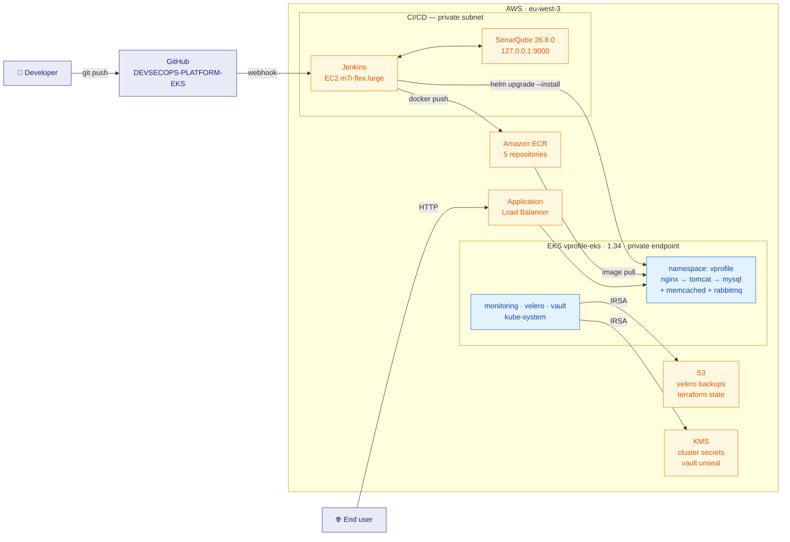

# Diagram 01 — High-Level Architecture

The whole system in one view. Every component shown is deployed.

## Flow

| Step | Action |
|---|---|
| 1 | Developer pushes to GitHub |
| 2 | Webhook triggers the Jenkins application pipeline |
| 3 | Maven build → SonarQube analysis → Trivy scan + SBOM |
| 4 | Five images pushed to ECR, tagged `<git-sha>-<build>` |
| 5 | `helm upgrade --install --atomic` deploys to the `vprofile` namespace |
| 6 | ALB Controller provisions/updates the ALB from the Ingress |
| 7 | End users reach the application over HTTP through the ALB |

## Boundaries

- **Jenkins and the EKS nodes are in private subnets.** No public IPs. Jenkins is reached via SSM Session Manager.
- **The EKS API endpoint is private-only.** All `kubectl`/`helm` operations originate inside the VPC.
- **The ALB is the only internet-facing component.**
