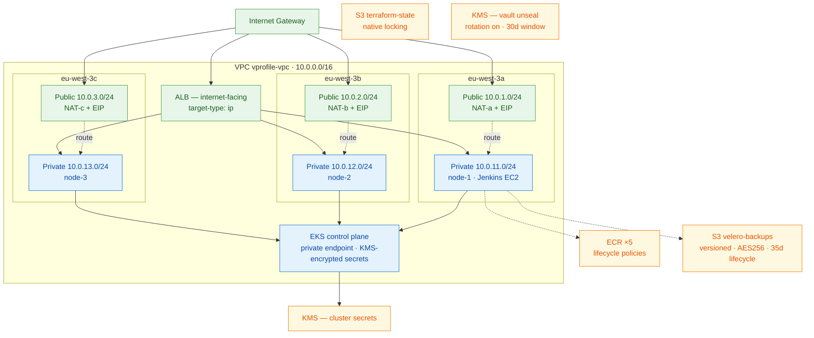

# Diagram 02 — AWS Infrastructure

Physical layout. Only resources that exist in `terraform/` are shown.



## Resource inventory

| Resource | Count | Source |
|---|---|---|
| VPC | 1 | `vpc.tf` |
| Public subnets | 3 | `10.0.1-3.0/24` |
| Private subnets | 3 | `10.0.11-13.0/24` |
| Internet Gateway | 1 | module |
| NAT Gateways | 3 | `one_nat_gateway_per_az = true` |
| Route tables | 5 | 1 public shared + 3 private + default |
| EKS cluster | 1 | `eks.tf`, v1.34 |
| Managed node group | 1 | 3× `m7i-flex.large`, max 5 |
| Jenkins EC2 | 1 | `m7i-flex.large`, 80 GiB |
| ECR repositories | 5 | `ecr-jenkins.tf` |
| S3 buckets | 2 | Velero + Terraform state |
| KMS keys | 2 | Cluster secrets + Vault unseal |

## Subnet tags — why they matter

```hcl
public_subnet_tags  = { "kubernetes.io/role/elb"          = 1 }
private_subnet_tags = { "kubernetes.io/role/internal-elb" = 1 }
```

Without these the AWS Load Balancer Controller cannot select subnets. The Ingress is accepted by
the API server and **no ALB is ever created** — a silent failure with no error anywhere.

## Not present

RDS · ElastiCache · Amazon MQ · Route 53 · ACM · CloudWatch dashboards
