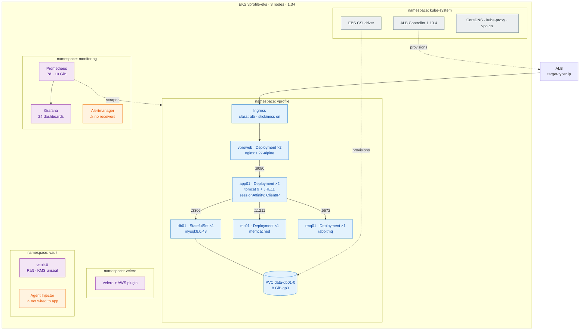

# Diagram 03 — Kubernetes Architecture

Workloads and namespaces. The application namespace renders 25 objects from the Helm chart.



## Chart object inventory — 25 objects

| Kind | Count | Names |
|---|---|---|
| ServiceAccount | 5 | `app01` `db01` `mc01` `rmq01` `vproweb` |
| Deployment | 4 | `app01`(2) `vproweb`(2) `mc01`(1) `rmq01`(1) |
| StatefulSet | 1 | `db01`(1) |
| Service | 5 | one per workload |
| Ingress | 1 | ALB |
| PodDisruptionBudget | 3 | `app01` `vproweb` `db01` |
| NetworkPolicy | 6 | see below |

## NetworkPolicies

```
default-deny        deny all ingress AND egress
allow-dns           egress → kube-system DNS
vproweb-ingress     ingress from ipBlock 10.0.0.0/16   ← ALB uses ENIs, not pods
vproweb-egress      egress → app01:8080
app01               ingress from vproweb; egress → db01/mc01/rmq01 only
backends-ingress    accept only from app01, no egress beyond DNS
```

Enforcement is active because `vpc-cni` is configured with `enableNetworkPolicy = "true"`.
Without it, policies are accepted and displayed but **never enforced**.

## PodDisruptionBudgets

| PDB | minAvailable | Effect |
|---|---|---|
| `app01` | 1 of 2 | Survives node drain |
| `vproweb` | 1 of 2 | Survives node drain |
| `db01` | 1 of 1 | **Deliberately blocks drain** — a single-replica DB should not be evicted silently |

## Storage

`gp3` is the default StorageClass; `gp2` is demoted by `bootstrap-addons.sh`.

| PVC | Size | Owner |
|---|---|---|
| `data-db01-0` | 8 GiB | MySQL |
| Prometheus | 10 GiB | monitoring |
| Grafana | 2 GiB | monitoring |
| Alertmanager | 2 GiB | monitoring |
| Vault | 4 GiB | vault |
