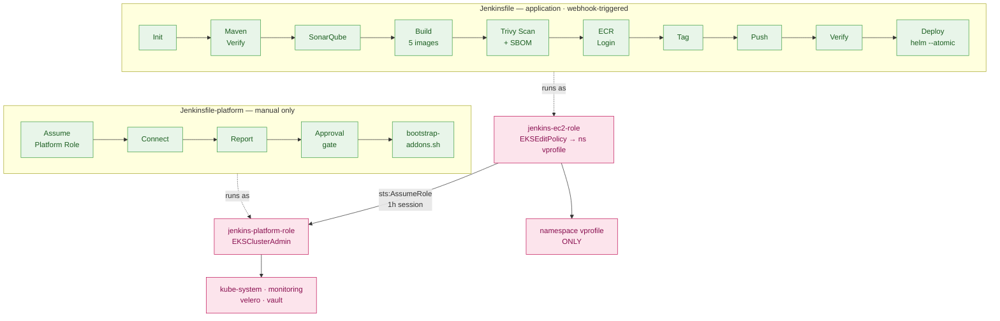

# Diagram 04 — CI/CD Pipeline

Two pipelines with two distinct IAM identities. The separation is the architecture.



## Application pipeline — stage contract

| Stage | Input | Output | Fails when |
|---|---|---|---|
| Init | Commit, build number | `IMAGE_TAG`, `ECR_REGISTRY` | AWS credentials unavailable |
| Maven Verify | Source | WAR + 9 test results | Compile or test failure |
| SonarQube | Source + WAR | Analysis + gate verdict | `SONAR_GATE=true` and gate fails |
| Build | Dockerfiles | 5 images | Any build fails |
| Trivy Scan | 5 images | 5 reports + 5 CycloneDX SBOMs | ⚠️ `--exit-code 1` absent → reports only |
| ECR Login | — | Docker auth | Registry unreachable |
| Tag / Push | Images | `<git-sha>-<build>` in ECR | Push failure |
| Verify | Tag | Manifest confirmation | A manifest is missing |
| Deploy | Chart + tag | Running release | Secret missing · render fails · rollout timeout |

**Trivy runs before ECR Login by design** — a vulnerable image should never reach the registry.

## Why the platform pipeline has no component picker

`bootstrap-addons.sh` runs six steps with real prerequisites:

```
1/6 vprofile namespace
2/6 gp3 StorageClass   ← monitoring, velero and vault ALL provision PVCs against it
3/6 ALB Controller     ← without it, an Ingress is accepted and no ALB is created
4/6 monitoring   5/6 velero   6/6 vault
```

Ordering is enforced by `set -euo pipefail` plus four explicit `exit 1` guards. A picker in
Jenkins would split that logic across two files and let a user reach step 5 without step 2 —
producing a successful build and a broken cluster.

**`ACTION` defaults to `verify`,** so an accidental "Build with Parameters" changes nothing.

## Post-build cleanup

Unconditional in `post`: image removal, `docker image prune`, `docker builder prune`, and
`docker logout` — ECR credentials do not persist on a shared build host between builds.
