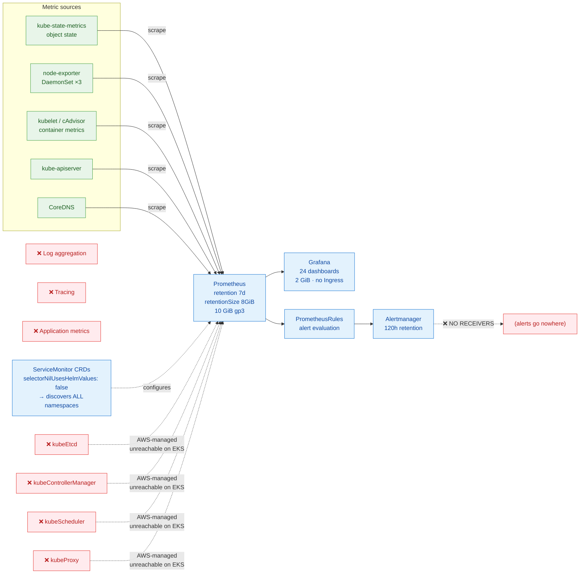

# Diagram 05 — Monitoring & Observability

Metric flow, exactly as deployed. The gaps are drawn as well as the paths.



## Monitoring vs. observability

**Monitoring** answers questions you knew to ask. **Observability** is the ability to answer
questions you did not anticipate — normally requiring metrics, logs *and* traces correlated per
request.

This project has **metrics only**. Calling it observability would overstate it; it is solid
infrastructure monitoring.

## The EKS-specific correction

On EKS the control plane is AWS-managed and unscrapeable. At their chart defaults, four scrape
targets produce **four permanently-firing alerts and empty panels from the first minute**.

**Disabling the scrape target is only half the fix.** The alert rule groups are still created and
fire on absent metrics:

```yaml
kubeControllerManager: { enabled: false }
kubeScheduler:         { enabled: false }
kubeEtcd:              { enabled: false }
kubeProxy:             { enabled: false }

defaultRules:
  rules:
    etcd: false
    kubeControllerManager: false
    kubeSchedulerAlerting: false
    kubeProxy: false
```

Verified: zero PrometheusRule groups for the disabled components in the rendered output.

## Cross-namespace discovery

```yaml
serviceMonitorSelectorNilUsesHelmValues: false
```

Without this, Prometheus discovers only ServiceMonitors created by its own Helm release. With it,
a ServiceMonitor placed in the `vprofile` namespace is picked up automatically.

## Measured footprint

```
375m CPU  ·  1.4 GiB RAM requests  ·  14 GiB EBS  ≈  $1.30/month
```

## Gaps

| Gap | Consequence |
|---|---|
| **Alertmanager has no receivers** | Alerts fire and are delivered nowhere. This is monitoring, not alerting. |
| **No log aggregation** | No Loki, no Fluent Bit. Debugging means `kubectl logs` per pod. |
| **No application metrics** | The Java app exposes no JVM or business metrics. No request rate, error rate or latency. |
| **No tracing** | Cannot follow a request across the five tiers. |
