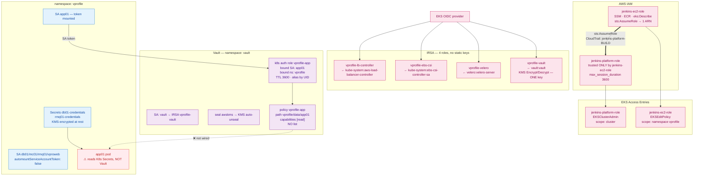

# Diagram 06 — Security & Secrets

Identity and secret flow. Every arrow is an implemented control.



## The AssumeRole boundary

| | Detail |
|---|---|
| **Prevents** | The application pipeline cannot touch `kube-system`, `vault`, `monitoring` or `velero` — even if `Jenkinsfile` is edited — because its role lacks the access |
| **Provides** | Attribution. CloudTrail records `AssumeRole` with session name `jenkins-platform-<build>` |
| **Does NOT prevent** | Anyone who can commit to `Jenkinsfile-platform` can assume the role. **Branch protection is not configured** — that is the control which closes this gap |

## Why ClusterAdmin, and why that is still least privilege

`AmazonEKSAdminPolicy` maps to the Kubernetes `admin` ClusterRole, which is **namespace-scoped**
and excludes CustomResourceDefinitions, ClusterRoles and webhook configurations — all three of
which the add-on charts create.

**The isolation is the separate assumed role, not a reduced policy.** The power exists only inside
a one-hour session, never as a standing grant.

## The Vault identity chain

```
Pod runs as ServiceAccount app01 (namespace vprofile)
      ↓ presents projected SA token
Vault validates via Kubernetes TokenReview API
      ↓ matches bound_service_account_names + bound_service_account_namespaces
Role vprofile-app → policy vprofile-app
      ↓
read on vprofile/data/app01 — 1-hour TTL
```

**Verified:** a login with the `app01` token returned `token_policies ["default" "vprofile-app"]`
and `token_meta_service_account_namespace: vprofile`.

**Alias by `serviceaccount_uid`, not name** — delete and recreate `app01` and it gets a new UID,
so a stale token cannot be replayed.

## ⚠️ The integration gap

The application reads its credentials from **Kubernetes Secrets**, not Vault. No
`vault.hashicorp.com/*` annotations exist in any chart template.

To close it:
1. Vault Agent Injector annotations on the `app01` pod template
2. A NetworkPolicy egress rule for `vprofile → vault` — currently **denied** by `default-deny`
3. Accept that Spring resolves placeholders at startup, so rotation needs a pod restart regardless

## Defence in depth summary

```
AWS IAM         2 Jenkins roles (one assumable) + 4 IRSA roles, no static keys
Network         private subnets · private cluster endpoint · SSM not SSH
K8s RBAC        access entries, CI scoped to one namespace
Pod network     6 NetworkPolicies, default-deny, CNI enforcement ON
Workload        drop ALL · no privilege escalation · seccomp RuntimeDefault
Secrets         KMS-encrypted at rest · none in Git · chart fails without them
Supply chain    Trivy pre-push · CycloneDX SBOM · commit-SHA tags
```
