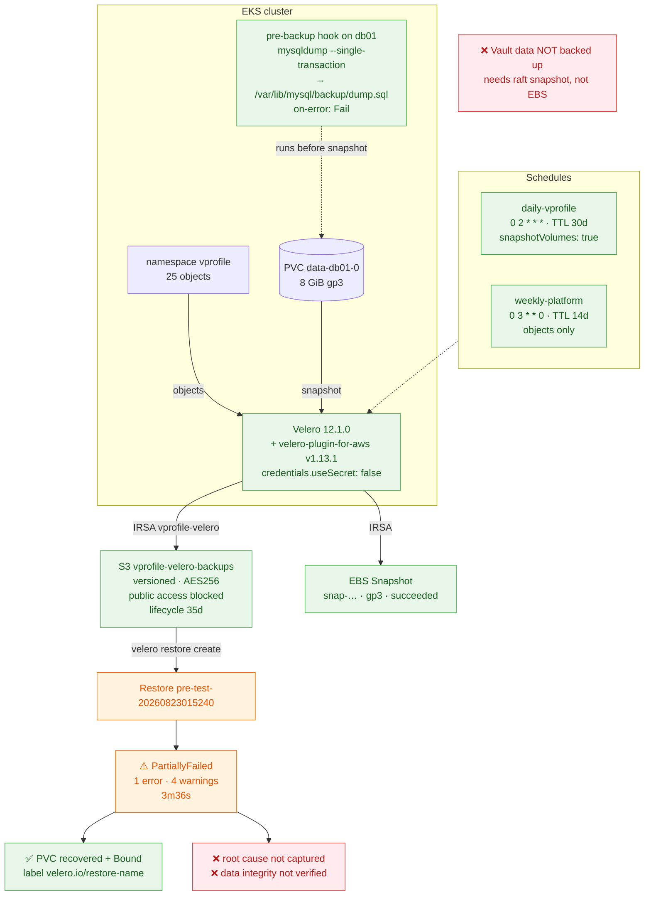

# Diagram 07 — Backup & Disaster Recovery

Backup paths and the **actual** restore result.



## The four-level distinction

```
Backup Configured  ≠  Backup Successful  ≠  Restore Tested  ≠  DR Validated
```

| Level | Status | Evidence |
|---|---|---|
| Configured | ✅ | `platform/values/velero.yaml`, `terraform/velero.tf` |
| Successful | ✅ | Backup `pre-test` → `Completed`, 0 errors; objects in S3 |
| Tested | ⚠️ | Restore executed → **`PartiallyFailed`**, 1 error, 4 warnings |
| **Validated** | ❌ | **Not achieved** |

## What the backup captured

```
Namespace              vprofile
PersistentVolume       pvc-f4ae6bd5-…
PersistentVolumeClaim  vprofile/data-db01-0
Pod                    7  (app01 ×2, db01-0, mc01, rmq01, vproweb ×2)
Secret                 db01-credentials, rmq01-credentials,
                       sh.helm.release.v1.vprofile.v1     ← Helm's own state
Service                5
ServiceAccount         6
Snapshot               snap-054d6106946926689 · gp3 · eu-west-3a · succeeded
HooksAttempted         1
```

Backing up the **Helm release secret** means Helm's view of the release is recoverable, not just
the raw objects.

## Why a `mysqldump` hook and not `FLUSH TABLES WITH READ LOCK`

The lock releases the moment the hook's session ends — which is **before** the snapshot is taken.
It would have no effect at all. This is the common mistake.

The dump writes a known-good logical export **into the volume**, so the snapshot captures both the
datadir and the dump.

`on-error: Fail` is deliberate: a backup that silently skipped its consistency step is worse than
one that failed loudly.

## Retention layering

```
Velero TTL       30 days   ← decides what is current
S3 lifecycle     35 days   ← cleans up afterwards
```

The order is deliberate. If S3 expired first, Velero would list backups that cannot restore.

## Restore result — stated precisely

```
velero restore create --from-backup pre-test --wait
Restore completed with status: PartiallyFailed

NAME                      BACKUP     STATUS           ERRORS  WARNINGS
pre-test-20260823015240   pre-test   PartiallyFailed  1       4
```

**Recovered:** the database PVC — `Status: Bound`, `Used By: db01-0`, carrying
`velero.io/restore-name=pre-test-20260823015240`, a label Velero applies only to objects it
restored.

**Unknown:** the error's cause, the four warnings, and whether the restored MySQL data is intact.

## Limitations

| Limitation | Impact |
|---|---|
| Restore `PartiallyFailed`, root cause not captured | **DR is not validated** |
| No data integrity check after restore | Volume bound ≠ data correct |
| **Vault's own data has no backup** | Needs `vault operator raft snapshot`; no schedule exists |
| Restore into a *fresh cluster* never attempted | The real DR scenario is untested |
| Terraform state protected by S3 versioning only | No MFA-delete |

## Next steps

```bash
velero restore logs pre-test-20260823015240 | grep -iE "error|warn"
velero restore describe pre-test-20260823015240 --details

# and the check that would make it conclusive, run before AND after:
kubectl -n vprofile exec db01-0 -- \
  mysql -uroot -p"$MYSQL_ROOT_PASSWORD" accounts -e "SELECT COUNT(*) FROM user;"
```
